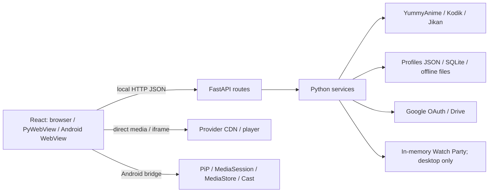

[English](README.md) | [Русский](README.ru.md)

# AnimeSoul [Full AI]

**Your anime library, playback and watch history — on your own device.**

AnimeSoul is a local application for discovering anime, watching episodes and managing a personal library. It runs a React + TypeScript interface with a Python/FastAPI backend in a browser, a Windows desktop window, or a standalone Android app.

[Download releases](https://github.com/Quidden/AnimeSoul/releases) · [Getting started](app/README.md) · [Technical documentation](app/docs/README.md) · [HTTP API](app/docs/API_REFERENCE.md)

## At a glance

| | |
| --- | --- |
| Version | **0.2.7**; profile schema **3** |
| Clients | Windows browser / PyWebView; Android WebView + embedded Python |
| Interface | React 19, TypeScript 5.9, Vite 8, global CSS, hls.js |
| Backend | FastAPI, Uvicorn, httpx; JSON persistence and SQLite caches/ratings |
| Integrations | YummyAnime, Kodik, Jikan episode dates, Google Drive, experimental Android Google Cast |
| Documentation | English (primary) and Russian; the current application UI is predominantly Russian |

## What you can do

- **Discover:** search with keyboard-layout correction, transliteration and aliases; filter and group franchises.
- **Watch:** choose seasons, episodes, dubs and providers; resume playback; use the built-in HLS player with quality, subtitles, speed, timeline previews, opening/ending skips and Picture-in-Picture when supported.
- **Organize:** favorites, custom folders, notes, multiple profiles, history, statistics, manual watched marks and rewatches.
- **Track releases:** follow new episodes across a franchise and selected dubs, with source-aware episode identity and release dates when available.
- **Keep episodes offline:** queue downloads, select seasons/ranges, inspect storage and play downloaded media. Android publishes completed MP4 files to MediaStore.
- **Back up and sync:** export/import profiles or synchronize with Google Drive using explicit merge and restore rules.
- **Rate:** personal anime/season/episode scores plus anonymous aggregates on the connected AnimeSoul server.
- **Watch together:** desktop/browser Watch Party rooms with host/shared control. Android intentionally omits Watch Party.
- **Cast on Android:** experimental Google Cast for direct online HTTPS HLS/MP4 streams; the TV receives the stream URL from the phone.

## Screenshots

### Windows library


### Playback settings and appearance


### Android

<p align="center">
  
  
</p>

[Screenshot gallery and capture notes](app/docs/SCREENSHOTS.md). Images show the Russian UI; documentation language does not change the application language.

## Get started

For packaged Windows and Android builds, use [GitHub Releases](https://github.com/Quidden/AnimeSoul/releases). For Windows source startup, run [Start AnimeSoul.bat](Start%20AnimeSoul.bat). It prepares missing dependencies, builds the frontend when needed and starts the saved launch mode.

Source requirements: **Python 3.11+ and Node.js 22+**. CI uses Python 3.12. Configure your YummyAnime **Public token** for its catalogue. Kodik direct playback and downloads require your Kodik Public/Private key pair. YummyAnime's private token is not used. Google Drive is optional and requires your own OAuth client configuration.

See [installation, development and checks](app/README.md), [Windows/Android build details](app/docs/PLATFORMS.md), and [Android update signing](app/mobile/UPDATE_SIGNING.md).

## How it fits together



The backend owns catalogue requests, credentials, local files and sync. Video streams, posters and embedded provider players can load directly in the client. Community ratings belong to the current backend instance; they are not a global AnimeSoul rating service. Watch Party and the download queue live in process memory and do not survive a process restart.

## Documentation

| Area | English | Русский |
| --- | --- | --- |
| Documentation index | [Index](app/docs/README.md) | [Оглавление](app/docs/README.ru.md) |
| Architecture and boundaries | [Architecture](app/ARCHITECTURE.md) | [Архитектура](app/ARCHITECTURE.ru.md) |
| UI components, state and events | [Frontend](app/docs/UI.md) | [Интерфейс](app/docs/UI.ru.md) |
| Services, lifecycle and persistence | [Backend](app/docs/BACKEND.md) | [Бэкенд](app/docs/BACKEND.ru.md) |
| HTTP, WebSocket, requests and errors | [API](app/docs/API_REFERENCE.md) | [API](app/docs/API_REFERENCE.ru.md) |
| Function calls and component relationships | [Flows](app/docs/ENTRY_POINTS_AND_FLOWS.md) | [Цепочки вызовов](app/docs/ENTRY_POINTS_AND_FLOWS.ru.md) |
| Data and sync | [Data](app/docs/DATA_MODEL.md) · [Drive](app/docs/GDRIVE_SYNC.md) | [Данные](app/docs/DATA_MODEL.ru.md) · [Drive](app/docs/GDRIVE_SYNC.ru.md) |
| Code map, styling and platform builds | [Map](app/docs/PROJECT_MAP.md) · [CSS](app/docs/STYLES.md) · [Platforms](app/docs/PLATFORMS.md) | [Карта](app/docs/PROJECT_MAP.ru.md) · [CSS](app/docs/STYLES.ru.md) · [Платформы](app/docs/PLATFORMS.ru.md) |

## Repository layout

| Directory | Role |
| --- | --- |
| [`app/`](app/) | Maintained Python/FastAPI + React implementation, Windows packaging and Android client |
| [`legacy-old-stack/`](legacy-old-stack/) | Archived Vinext/Electron implementation; migration/reference only |
| [`.github/workflows/`](.github/workflows/) | Windows CI: Ruff, backend unittest and frontend checks |

New product work belongs in `app/`. Legacy documentation describes the archived implementation. Release notes record historical versions and are not the current API contract.

## Save portability

Use Settings → Profiles to export/import a single profile. To copy the complete document between source and legacy directories, close both runtimes and run from `app/`:

```powershell
.\.venv\Scripts\python.exe -m tools.transfer_saves to-main
# Reverse direction:
.\.venv\Scripts\python.exe -m tools.transfer_saves to-legacy
```

The tool validates the document, backs up an existing destination and replaces it atomically. Credentials and downloaded videos are separate from portable profiles. [Save compatibility](app/SAVE_COMPATIBILITY.md) explains custom/installed data paths and recovery.

Thanks to the YummyAnime developers for the API that made AnimeSoul possible. Media availability, dubs, subtitles, preview frames and playback quality depend on external providers.
