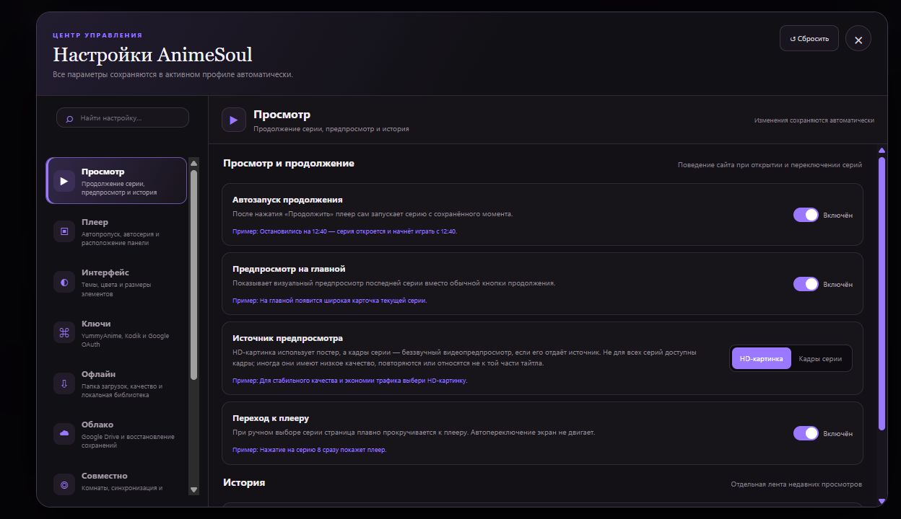
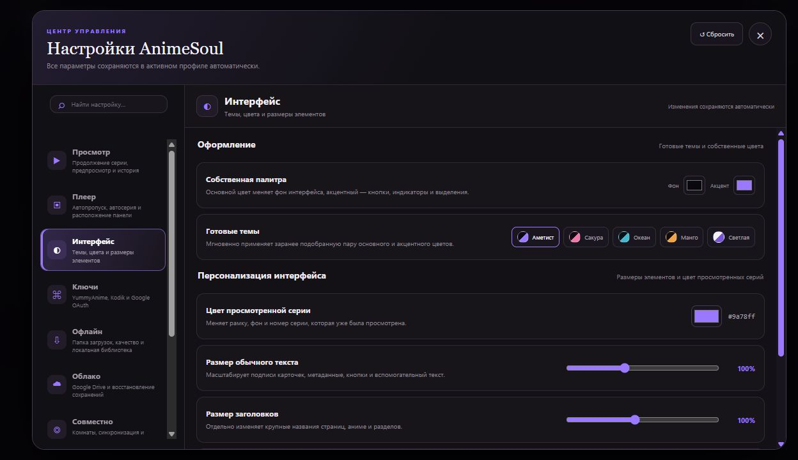
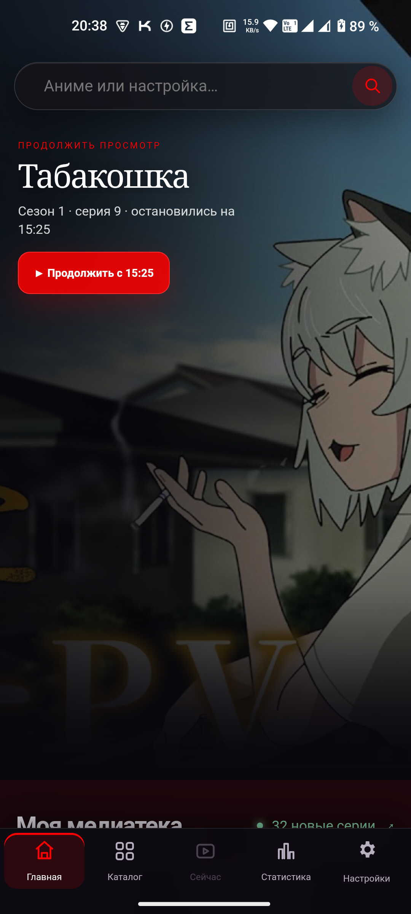
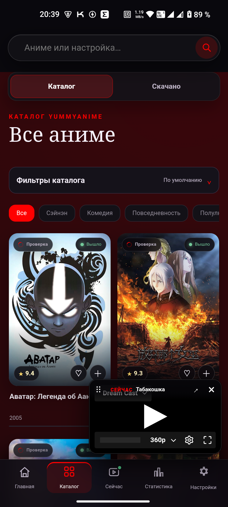
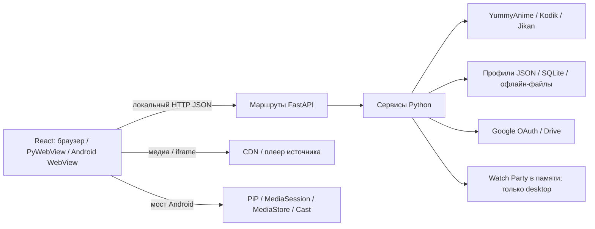

[English](README.md) | [Русский](README.ru.md)

# AnimeSoul [Full AI]

**Личная аниме-библиотека, просмотр и история — на вашем устройстве.**

AnimeSoul — локальное приложение для поиска аниме, просмотра серий и ведения личной библиотеки. Интерфейс React + TypeScript работает с Python/FastAPI в браузере, desktop-окне Windows или самостоятельном Android-приложении.

[Скачать релизы](https://github.com/Quidden/AnimeSoul/releases) · [Начало работы](app/README.ru.md) · [Техническая документация](app/docs/README.ru.md) · [HTTP API](app/docs/API_REFERENCE.ru.md)

## Кратко о проекте

| | |
| --- | --- |
| Версия | **0.2.7**; схема профиля **3** |
| Клиенты | Браузер / PyWebView на Windows; Android WebView + встроенный Python |
| Интерфейс | React 19, TypeScript 5.9, Vite 8, глобальный CSS, hls.js |
| Бэкенд | FastAPI, Uvicorn, httpx; JSON и SQLite для кеша/оценок |
| Интеграции | YummyAnime, Kodik, Jikan для дат серий, Google Drive, экспериментальный Google Cast на Android |
| Документация | Английский (основной) и русский; интерфейс приложения преимущественно русский |

## Возможности

- **Поиск:** исправление раскладки, транслитерация, псевдонимы, фильтры и группировка франшиз.
- **Просмотр:** сезоны, серии, озвучки, источники и продолжение с сохранённого момента; собственный HLS-плеер с качеством, субтитрами, скоростью, предпросмотром шкалы, пропуском опенинга/эндинга и Picture-in-Picture при поддержке платформы.
- **Библиотека:** избранное, папки, заметки, несколько профилей, история, статистика, ручные отметки и пересмотры.
- **Новые серии:** отслеживание франшизы и выбранных озвучек с учётом исходной идентичности серии и доступных дат выхода.
- **Офлайн:** очередь загрузок, выбор сезонов и диапазонов, статистика места и просмотр сохранённых файлов. Android публикует готовые MP4 через MediaStore.
- **Сохранения:** импорт/экспорт профилей, синхронизация Google Drive с явными правилами слияния и восстановления.
- **Оценки:** личные оценки тайтлов, сезонов и серий; анонимные агрегаты подключённого сервера AnimeSoul.
- **Совместный просмотр:** комнаты с управлением хоста или участников на desktop/в браузере. В Android Watch Party отключён.
- **Трансляция Android:** экспериментальный Google Cast для прямых онлайн HTTPS HLS/MP4; телефон передаёт телевизору ссылку потока.

## Скриншоты

### Библиотека Windows


### Настройки просмотра и оформления





### Android

<p align="center">
  
  
</p>

[Галерея и условия съёмки](app/docs/SCREENSHOTS.ru.md). Снимки показывают русский UI; язык документации не переключает язык приложения.

## Начало работы

Готовые сборки Windows и Android доступны в [GitHub Releases](https://github.com/Quidden/AnimeSoul/releases). Для запуска исходников на Windows откройте [Start AnimeSoul.bat](Start%20AnimeSoul.bat): скрипт подготовит зависимости, при необходимости пересоберёт frontend и запустит сохранённый режим.

Для исходников нужны **Python 3.11+ и Node.js 22+**; CI использует Python 3.12. Для каталога YummyAnime настройте свой **Public token**. Для прямого плеера и загрузок Kodik нужна собственная пара Public/Private. Приватный токен YummyAnime не используется. Google Drive подключается по желанию через собственный OAuth-клиент.

Подробности: [установка, разработка и проверки](app/README.ru.md), [сборки платформ](app/docs/PLATFORMS.ru.md), [подпись обновлений Android](app/mobile/UPDATE_SIGNING.ru.md).

## Связи компонентов



Бэкенд управляет каталогом, ключами, файлами и синхронизацией. Видео, постеры и iframe источников могут загружаться непосредственно клиентом. Общие оценки относятся к текущему серверу, а не к глобальному сервису AnimeSoul. Комнаты и очередь загрузок находятся в памяти процесса и не переживают его перезапуск.

## Документация

| Раздел | English | Русский |
| --- | --- | --- |
| Оглавление | [Index](app/docs/README.md) | [Оглавление](app/docs/README.ru.md) |
| Архитектура и границы | [Architecture](app/ARCHITECTURE.md) | [Архитектура](app/ARCHITECTURE.ru.md) |
| UI, состояние, события | [Frontend](app/docs/UI.md) | [Интерфейс](app/docs/UI.ru.md) |
| Сервисы и жизненный цикл | [Backend](app/docs/BACKEND.md) | [Бэкенд](app/docs/BACKEND.ru.md) |
| HTTP / WS, запросы и ошибки | [API](app/docs/API_REFERENCE.md) | [API](app/docs/API_REFERENCE.ru.md) |
| Функции и цепочки вызовов | [Flows](app/docs/ENTRY_POINTS_AND_FLOWS.md) | [Цепочки](app/docs/ENTRY_POINTS_AND_FLOWS.ru.md) |
| Данные и синхронизация | [Data](app/docs/DATA_MODEL.md) · [Drive](app/docs/GDRIVE_SYNC.md) | [Данные](app/docs/DATA_MODEL.ru.md) · [Drive](app/docs/GDRIVE_SYNC.ru.md) |
| Карта кода, CSS, платформы | [Map](app/docs/PROJECT_MAP.md) · [CSS](app/docs/STYLES.md) · [Platforms](app/docs/PLATFORMS.md) | [Карта](app/docs/PROJECT_MAP.ru.md) · [CSS](app/docs/STYLES.ru.md) · [Платформы](app/docs/PLATFORMS.ru.md) |

## Структура репозитория

| Каталог | Назначение |
| --- | --- |
| [`app/`](app/) | Поддерживаемая реализация Python/FastAPI + React, упаковка Windows и клиент Android |
| [`legacy-old-stack/`](legacy-old-stack/) | Архив Vinext/Electron для миграции и справки |
| [`.github/workflows/`](.github/workflows/) | CI на Windows: Ruff, unittest бэкенда и проверки frontend |

Новая функциональность разрабатывается в `app/`. Документы legacy относятся к архиву. Заметки о релизах описывают исторические версии и не заменяют актуальный контракт API.

## Перенос сохранений

Один профиль переносится через «Настройки → Профили». Полный документ между текущим и legacy-каталогом переносится после закрытия обоих runtime командой из `app/`:

```powershell
.\.venv\Scripts\python.exe -m tools.transfer_saves to-main
# Обратное направление:
.\.venv\Scripts\python.exe -m tools.transfer_saves to-legacy
```

Утилита проверяет документ, создаёт резервную копию назначения и заменяет файл атомарно. Ключи и скачанные видео хранятся отдельно от профиля. [Совместимость сохранений](app/SAVE_COMPATIBILITY.ru.md) описывает произвольные пути, установленную версию и восстановление.

Спасибо разработчикам YummyAnime за API, благодаря которому появился AnimeSoul. Доступность видео, озвучек, субтитров, кадров и качества зависит от внешних источников.
