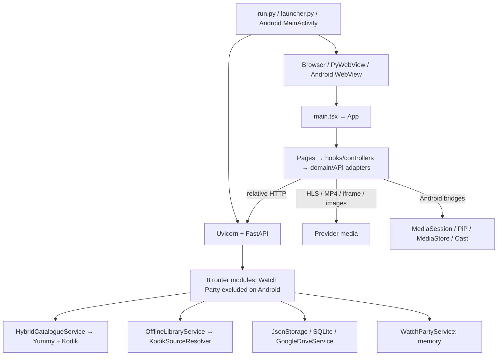

[English](ARCHITECTURE.md) | [Русский](ARCHITECTURE.ru.md)

# Architecture

AnimeSoul is a local SPA with one FastAPI process per running instance. Browser and PyWebView use the same endpoints and profile document. Android embeds Python and serves the same UI to a WebView. This guide describes version 0.2.7, checked against source on 2026-09-16.



## Dependency direction

```text
pages/components → feature hooks/controllers → feature API/domain → shared types
FastAPI routes  → services / pure policy     → HTTP, files, SQLite
runtime shells  → backend + static frontend
```

Pure selectors do not import React. Routers parse transport and map errors; services own I/O and policy. Google Drive merge is a pure module, independently testable without OAuth. UI catalogue calls use local adapters; direct playback/images/iframes remain external client media requests.

## Frontend ownership

| Area | Responsibility |
| --- | --- |
| `main.tsx` | Debug capture, global styles, StrictMode/createRoot |
| `App.tsx` | Composition of profile, catalogue, ratings, tracking and navigation state |
| `features/navigation/useAppNavigation.ts` | Screen transitions and native back; active player lifetime on Android |
| `features/storage/` | Profile hydration, migration, snapshot/document construction and debounced autosave |
| `features/catalog/` | Transport, loading/filter state, franchise/card presentation |
| `features/library/` | Pure progress/history/statistics selectors and folder management |
| `components/Player.tsx` | Watch screen, family/video selection and player orchestration |
| `features/player/` | Native HLS player, menus, downloads, offline playback, Cast, dates and Watch Party panels |
| `features/settings/` | Settings groups, credentials, OAuth, cloud choice and profile UI |
| `lib/types.ts`, `lib/events.ts` | Shared domain types and typed browser event names |

Navigation uses React state, not a URL router. Heavy pages and the player are lazy loaded. [UI details](docs/UI.md).

## Backend ownership

| Router | Service / purpose |
| --- | --- |
| `yummy.py` | `HybridCatalogueService`, `YummyAnimeGateway`, `KodikAnimeGateway`; metadata and credential checks |
| `kodik.py` | `OfflineLibraryService.playback_source`; direct playback and ping |
| `downloads.py` | `OfflineLibraryService`; queue, files, settings and network policy |
| `episode_dates.py` | `EpisodeDatesGateway`; independent calendar dates |
| `storage.py` | `JsonStorage`, shared Drive autosave service |
| `gdrive.py` | Shared `GoogleDriveService`, pure merge, OAuth completion and restore |
| `community_ratings.py` | `CommunityRatingStore`, anonymous per-browser vote tree |
| `watch_party.py` | `WatchPartyService`, REST polling contract and optional WS snapshots |

`main.py` installs CORS for Vite, timing/cache middleware, health, routers and the production SPA fallback. Lifespan closes provider pools on shutdown. [Backend details](docs/BACKEND.md).

## Persistence and boundaries

- **Portable:** schema-3 JSON profiles: favorites, folders/notes, progress/rewatches, ratings, tracking and UI preferences. Frontend migrates known fields and preserves unknown root/profile/snapshot fields.
- **Device-local:** credentials, OAuth pending/tokens, offline files/index, runtime identity, cache, debug and zoom. Download files are not uploaded with a profile.
- **Per-server:** anonymous community-rating SQLite database. Different local backends do not share a global aggregate.
- **Ephemeral:** Watch Party rooms, active download jobs, connection pools and request coordination. Restart does not restore a queue or room.

`JsonStorage` validates a usable envelope and shares locks by resolved file path. It writes a temporary file and atomically replaces the save; cloud replacement creates a backup. [Data model](docs/DATA_MODEL.md), [Drive policy](docs/GDRIVE_SYNC.md).

## External access

YummyAnime Public token is sent server-side as `X-Application`; no Yummy private token is used. Kodik signing happens in Python; its private key is DPAPI-protected on Windows and kept in the Android private storage path. No private key belongs in frontend responses or exported profiles. Google credentials/tokens are local files. The loopback API has no general user authentication; CORS is not server authentication.

Cast sends a direct media URL to the receiver while FastAPI remains on loopback. Only the top local-origin WebView page receives the Cast message bridge. Party tokens identify participants and are stored in sessionStorage; REST polling is the active React protocol, not WebSocket.

## Extending the system

Add upstream calls to a backend service and a frontend transport adapter. Add persistent fields to types, defaults/migration, snapshot builders, merge rules and both language guides. Keep timers/listeners in hooks with cleanup. Preserve CSS import order and unknown JSON fields during refactoring. Moving code does not by itself change the product version or save schema.

[Function flows](docs/ENTRY_POINTS_AND_FLOWS.md) · [Project map](docs/PROJECT_MAP.md) · [API](docs/API_REFERENCE.md) · [CSS](docs/STYLES.md)
