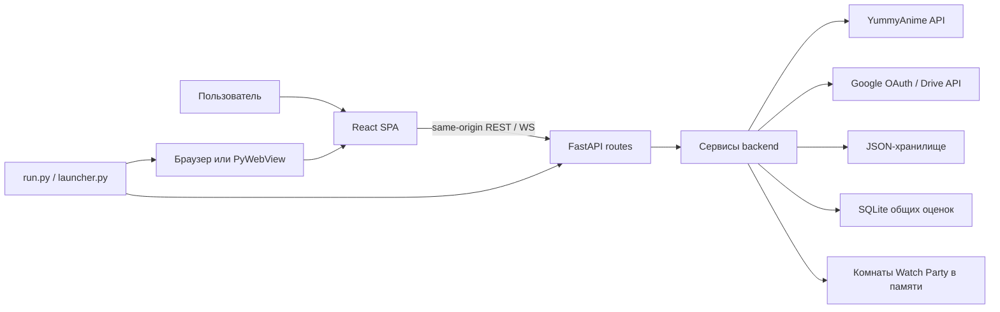

# Архитектура AnimeSoul

AnimeSoul — локальное SPA с единым FastAPI-процессом для браузерного и
desktop-режима. Интерфейс не обращается к YummyAnime или файловой системе
напрямую: сетевые и файловые границы проходят через backend.

## Контур системы



В разработке Vite работает на порту 5173 и проксирует относительные маршруты
на FastAPI 8000. В собранной версии FastAPI раздаёт `frontend/dist`, поэтому
контракты frontend не зависят от режима запуска.

## Направление зависимостей

```text
страницы/компоненты -> feature hooks/controllers -> feature API/domain -> lib/types
FastAPI routes      -> services/pure policy       -> сеть/файлы/SQLite
launcher/run.py     -> FastAPI application        -> React static bundle
```

Обратные зависимости запрещены: чистые селекторы не импортируют React,
компоненты не собирают URL внешнего API, сервисы не импортируют frontend, а
router не должен содержать правила слияния данных.

## Frontend

### Инициализация и оболочка

- `app/frontend/index.html` предоставляет `#root`.
- `app/frontend/src/main.tsx` устанавливает перехват журнала, импортирует
  глобальный CSS и монтирует `<App />` в `StrictMode`.
- `app/frontend/src/App.tsx` — координатор экранов. Он связывает хранилище,
  каталог, оценки, трекинг и маршрутизацию состояния, но не выполняет raw HTTP.
- `app/frontend/src/lib/types.ts` — общий TypeScript-контракт доменных данных.
- `app/frontend/src/lib/events.ts` — единственный реестр межфункциональных
  `CustomEvent`.

### Страницы и компоненты

`pages/` получает готовые view models и callback-функции. `components/` содержит
повторно используемые элементы и оставшиеся orchestration shells (`Player`,
`SettingsCenter`). Детальная карта находится в
[`docs/PROJECT_MAP.md`](docs/PROJECT_MAP.md).

### Features

- `features/catalog/` — транспорт каталога, состояние загрузки и presentation;
- `features/library/` — чистые выборки истории, прогресса и статистики;
- `features/player/` — части страницы просмотра и действия активного тайтла;
- `features/ratings/` — чтение/публикация агрегированных оценок;
- `features/settings/` — вкладки, оформление, профили и Google Drive;
- `features/storage/` — построение документов и жизненный цикл профилей;
- `features/tracking/` — загрузка снимка доступных серий;
- `features/watch-party/` — transport-контракт комнаты.

Feature API-файлы отвечают только за HTTP и нормализацию ответа. Чистые правила
находятся в `lib/` или selector-файлах. Таймеры, подписки и отмена запросов
принадлежат hooks/controllers.

## Backend

### Application и routes

`app/backend/app/main.py` создаёт FastAPI, включает CORS для Vite, регистрирует
пять router-модулей и при наличии production bundle добавляет static/SPA
fallback.

| Router | Контракт | Делегирует |
| --- | --- | --- |
| `api/yummy.py` | `/api/yummy` | `YummyAnimeGateway` |
| `api/storage.py` | `/api/storage` | `JsonStorage`, очередь Drive |
| `api/watch_party.py` | `/watch-party/*`, `/ws/watch-party/*` | `WatchPartyService` |
| `api/gdrive.py` | `/api/gdrive/*` | общий `GoogleDriveService` |
| `api/community_ratings.py` | `/api/community-ratings*` | `CommunityRatingStore` |

Router разбирает transport-поля, применяет ограничения HTTP и переводит
известные ошибки в статус/JSON. Полный контракт — в
[`docs/API_REFERENCE.md`](docs/API_REFERENCE.md).

### Services и policy

- `services/yummy.py` — заголовки, таймауты, общий HTTP connection pool, поиск
  с вариантами, cache/in-flight dedup и рекурсивная нормализация URL;
- `services/response_cache.py` — общий для Windows и Android SQLite cache с
  memory hot-layer и stale-if-error резервом;
- `services/storage.py` — последовательная атомарная JSON-запись и одноразовый
  импорт legacy-сохранения;
- `services/watch_party.py` — комнаты, участники, роли и playback в памяти;
- `services/gdrive.py` — OAuth, refresh token, Drive I/O и очередь autosave;
- `services/gdrive_merge.py` — чистые детерминированные правила merge;
- `services/community_ratings.py` — SQLite, одна заменяемая оценка на
  `(voter_id, anime_id)` и публичные агрегаты.

`gdrive_merge.py` не выполняет сеть или файловые операции. Это намеренная
граница: конфликтную политику можно тестировать без OAuth.

## Данные и сохранение

Основной документ имеет `schemaVersion: 3`, содержит список профилей и активный
профиль. Backend проверяет наличие массива `profiles`, после чего обращается с
остальной частью как с непрозрачным JSON. Миграция известных полей выполняется
в frontend через `migrateDocument`/`migrateSnapshot`.

Неизвестные поля сохраняются на трёх уровнях:

- корень `StorageDocument`;
- `ConfigProfile`;
- `ConfigSnapshot` при построении следующего снимка.

Это обеспечивает двустороннюю совместимость с legacy и будущими версиями.
Полная схема и localStorage-ключи описаны в
[`docs/DATA_MODEL.md`](docs/DATA_MODEL.md).

## Основные потоки

### Загрузка профиля

```text
main.tsx -> App -> useProfileStorage
         -> GET /api/storage
         -> JsonStorage.read
         -> resolveActiveProfileDocument
         -> migrateDocument + migrateSnapshot
         -> React state + localStorage mirror
```

### Сохранение

```text
изменение React state
-> useProfileStorage (debounce 400 ms)
-> buildProfileSnapshot -> buildStorageDocument
-> PUT /api/storage?auto_sync=...
-> JsonStorage.write (temp + atomic replace)
-> optional GoogleDriveService.schedule_write
```

### Каталог

```text
UI -> useCatalogController -> features/catalog/api.ts
-> GET /api/yummy -> api/yummy.py
-> YummyAnimeGateway -> https://api.yani.tv
-> нормализованный JSON -> selectors/components
```

### Совместный просмотр

```text
Player -> useWatchParty (раз в 1 секунду)
-> POST /watch-party/update
-> GET /watch-party/state
-> guard playbackChangedByUser / roomPlaybackRevision
-> onHostState -> Player
```

WebSocket endpoint существует для push-совместимости, но текущий React-клиент
считает REST-поллинг авторитетным и WebSocket не открывает.

Подробные цепочки с именами функций находятся в
[`docs/ENTRY_POINTS_AND_FLOWS.md`](docs/ENTRY_POINTS_AND_FLOWS.md).

## Стили

`src/main.tsx` импортирует `globals.css`; он последовательно импортирует общий
манифест и feature-файлы. Порядок — часть контракта каскада. Темы и масштабы
применяются через CSS custom properties из `useProfileStorage`, а desktop zoom
дополнительно устанавливает `documentElement.style.zoom`.

Владельцы файлов, токены, точки inline-стилей и правила изменения описаны в
[`docs/STYLES.md`](docs/STYLES.md).

## Внешние границы и безопасность

- Public token YummyAnime остаётся на backend и передаётся upstream в
  `X-Application`; приватный token YummyAnime не используется.
- Публичный и приватный ключи Kodik используются только локальным backend для
  подписания `/api/video-links`. Приватный ключ защищён Windows DPAPI и никогда
  не включается в профиль, экспорт или JSON-ответ frontend.
- Google OAuth-токены и credentials хранятся в локальном data-каталоге и не
  входят в профиль/экспорт.
- Cookie общих оценок — `HttpOnly`, `SameSite=Lax`; API возвращает только
  агрегаты, не `voter_id`.
- Watch Party token является идентификатором участника комнаты и хранится в
  `sessionStorage`; комнаты исчезают при завершении процесса.
- Frontend получает iframe URL как резервный источник. Для Kodik backend может
  выдать подписанные HLS-варианты, субтитры и сегменты собственному плееру;
  встроенный iframe остаётся переключаемым fallback.

## Правила расширения

1. Новый upstream-вызов добавляется в backend service и feature API, не в JSX.
2. Новое сохраняемое поле добавляется в тип, миграцию, документацию данных и
   тест round-trip/merge.
3. Расчёт без I/O оформляется чистой функцией и тестируется напрямую.
4. Подписка или таймер оформляются hook с явным cleanup.
5. Новый CSS владелец подключается через существующий манифест; порядок импорта
   меняется только после визуальной проверки.
6. Изменение HTTP/WS-контракта одновременно отражается в ручном API-справочнике
   и тестах вызывающей стороны.
7. Перемещение кода без изменения поведения не повышает версию продукта или
   схему сохранения.
