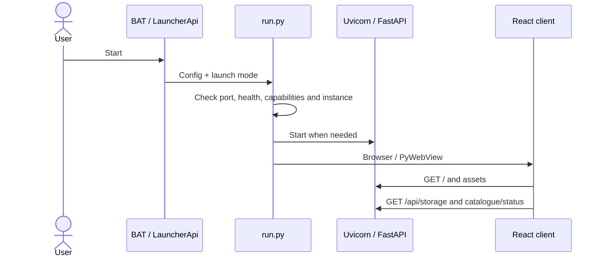

[English](ENTRY_POINTS_AND_FLOWS.md) | [Русский](ENTRY_POINTS_AND_FLOWS.ru.md)

# Entry points, exits and function calls

Paths are relative to `app/` unless prefixed otherwise. [API](API_REFERENCE.md) · [UI](UI.md) · [Backend](BACKEND.md)

## Process entry points and exits

| Entry | Calls / result |
| --- | --- |
| Repository `Start AnimeSoul.bat` | Delegates to `app/Start AnimeSoul.bat` |
| App BAT launchers | venv / changed-only preparation → `run.py`; browser/desktop/configure variants pass arguments |
| `run.py::main` | Parse arguments → load runtime settings → check port/runtime compatibility → start/open client |
| `launcher.py::main` | PyWebView launcher UI with `LauncherApi` → launch/open/stop runtime |
| `backend.app.main:app` | ASGI entry for Uvicorn and tests |
| `frontend/index.html`, `src/main.tsx` | Debug capture, CSS, StrictMode/createRoot → App |
| Android `MainActivity`, `mobile_runtime.py` | Embedded Python/FastAPI → local WebView → native bridges |
| `tools.transfer_saves.main` | Validate → destination backup → atomic copy |

`run.py` exit codes: 0 normal/already-running client; 2 invalid config; 3 no available port; 4 missing PyWebView for desktop; 5 backend not ready for desktop. Occupied unrelated ports are not killed: search the next available user port. Runtime health includes a capability check, so a matching stack name alone is insufficient for reuse.

Browser mode runs Uvicorn in the foreground. Desktop close sets `server.should_exit`, waits for the server thread, and removes runtime state owned by its instance ID. Launcher stop requires matching process identity. Backend lifespan closes provider clients. React effects unsubscribe/clear timers; disconnected WS sockets leave the room socket list.

## Startup



Packaged launch: `webview.create_window(LAUNCHER_HTML, js_api=LauncherApi) → pywebviewready → get_settings/get_server_status → launch`. Launch validates fields/token, saves configuration, chooses runtime command, uses subprocess and writes runtime identity. An already-running compatible server opens another client without another backend process.

## Profile hydrate/save

```text
useProfileStorage.hydrateFileStorage
 → GET /api/storage → JsonStorage.read → optional first legacy import
 → resolveActiveProfileDocument → migrateDocument/migrateSnapshot
 → applyStorageProfile → applySnapshot → React + localStorage mirror
404 → createDocumentFromBrowserBackup → PUT /api/storage
Other failure → storage safety state; do not silently overwrite

React state change → useProfileAutosave (400 ms debounce)
 → buildProfileSnapshot → buildStorageDocument → saveStorageDocument
 → PUT /api/storage?auto_sync=...&folder_mode=...&prefer_watched=...
 → validate_storage_document → JsonStorage.write (shared lock/temp/replace)
 → optional GoogleDriveService.schedule_write
 → usePublishedSaveStatus → event/mirror → Header
```

Builders preserve unknown envelope/profile/snapshot fields. Local save success is independent of cloud upload confirmation.

## Catalogue, family and playback

```text
Header/CatalogPage query
 → useCatalogController (300 ms search prefetch)
 → cachedCatalogSearch / fetchCatalogPage → GET /api/yummy
 → yummy_proxy → HybridCatalogueService.catalogue/details
 → YummyAnimeGateway / KodikAnimeGateway + persistent cache/identity registry
 → normalized Anime[] + _sources → uniqueAnime/useCatalogPresentation
 → visible franchise cards; near-viewport metadata concurrency 2

AnimeCard → useAppNavigation.openAnime → active Anime → Watch
 → fetchFamily → viewing_order or details/search fallback → SeasonGroup[]
 → fetchVideos (selected group first, remaining groups concurrency 2)
 → hybrid videos + episode identity normalization
 → originAnimeId/originNumber and display numbering → season/episode/dub/source
 → fetchKodikStream → POST /api/kodik/stream
 → playback_source → KodikSourceResolver.resolve_playback_api
 → AnimeSoulPlayer (HLS/video, subtitles/skips)
 → provider iframe on fallback/selection
```

`loadMore` may fetch up to five pages of 48 to collect 12 new cards after grouping/filtering. Stored IDs missing from the catalogue are hydrated via details batches. Query cache and in-flight coordination avoid duplicate work. Media URLs are runtime output, not persistent episode identity.

## Progress, tracking and ratings

```text
Player event or manual episode toggle
 → EpisodeState/AnimeProgress → createActiveWatchActions.updateProgress
 → changed/newly watched keys → immutable progress + local mirror
 → acknowledgeTrackedEpisode for original keys → tracking state
 → debounced profile save
```

`toggleEpisodeWatched` retains `manualPrevious` for undo. Natural completion, rewind/rewatch and auto-next are separate decisions. `latestResumePoint` and `episodeResumePosition` select a meaningful resume point rather than the end of a completed episode.

Tracking: `useEpisodeTracking → fetchTrackingSnapshot → resolveFranchiseAnimeIds → details → videos for each part → collectPlayableEpisodeDates(selected/all dubs) → reconcileTrackedEpisodes → state/mirror/save`. Runs immediately and every 300 seconds, skipping entries checked within 240 seconds. Partial success can update valid parts; all-failed snapshots do not replace the baseline. Identity repair is conditional on both providers' successful evidence/version.

Ratings: `ScorePicker → setUserRating → personal map → profile save`. Separately, `useCommunityRatings → publishCommunityRating → PUT community-ratings → CommunityRatingStore.replace → aggregate → UI`. Publication debounce is 500 ms, retry is 30 seconds, reads are in batches of 100; deletions retain a tombstone queue.

## Offline and Android Cast

```text
DownloadPicker → useDownloadManager → checkDownloadAvailability
 → POST /api/downloads/availability → resolver checks exact quality
 → enqueueDownload → POST /api/downloads/jobs → OfflineLibraryService.enqueue
 → sequential worker → source resolution → download/FFmpeg → file + index
 → jobs/library polling → DownloadsPage
 → useOfflinePlayback → media endpoint → same AnimeSoulPlayer
```

Android `AnimeSoulDownloads` bridge starts foreground monitoring; `DownloadNetworkMonitor` posts network type. Disallowed mobile data pauses a job; permitted network resumes it. `NativeDownloadSupport`/FFmpegKit publishes MediaStore MP4. Jobs are process-memory state; existing MediaStore files can be scanned after index loss.

Cast: `useAndroidCast → castMediaSource → sendCastCommand → AnimeSoulCast.postMessage → CastController → Google Default Media Receiver`. Native status returns as `cast-state` → player/session bar/progress; returning to phone restores playback paused. Direct online HTTPS HLS/MP4 only. No backend LAN listener is opened.

## Watch Party

Create/join: `WatchPartyPanel → useWatchParty → postWatchParty → WatchPartyService.create/join → protocol check (2) → sessionStorage`.

Every second: `tick → playbackChangedByUser/playbackReachedTarget → POST update → service update/broadcast → GET state → normalize/role update → roomPlaybackRevision → onHostState`. Remote playback suppression (12 seconds) prevents applied remote seek/play from being re-published as local control. The current React hook uses REST, not WS. Android removes this feature.

## OAuth and sync

```text
CredentialsSettings → save/check credentials API → per-field checks
CloudSettings/useGoogleDriveSettings → auth-url → Google browser login
 → callback code/state → consume_oauth_state
 → desktop: exchange_code → userinfo/cloud inspection → save tokens
 → Android: save pending callback → foreground POST complete-auth → exchange once
 → status polling → first-choice modal if cloud already exists

Explicit sync → POST /api/gdrive/sync → first-choice/validation guard
 → read local/cloud → upload / restore-with-backup / merge policy
 → write local/cloud as required → mark_sync_succeeded|failed
 → reloadStorage → rehydrate profile
```

Instant: `PUT storage → schedule_write → replace pending → latest local read → cloud read → merge → cloud write → local write only if no newer local save`. Interval mode comes from `useHeaderCloudSync`; manual has no automatic upload. Header/settings status polling is 2.5 seconds while mounted/open. Both frontend and backend block automatic first sync pending explicit choice.

## Import/export, styles and outputs

Profile export: `ProfileSettings → exportConfig → makeSnapshot → JSON Blob → browser download → revoke object URL`. Import: file text/JSON → migrateSnapshot → new UUID/name → save existing/current profile → optional switch/reload. Full transfer: paths_for → read/validate → backup destination → temp/replace; source unchanged.

Styles: `main.tsx → globals.css → base manifest → feature bundles → runtime theme/preferences variables → optional desktop zoom`. [CSS order](STYLES.md).

Outputs: profile JSON; downloaded media/index; Google Drive file; per-server rating SQLite; in-memory room state/WS snapshots; device debug journal/export. Credentials, runtime identity and native state remain outside portable profile exports.
