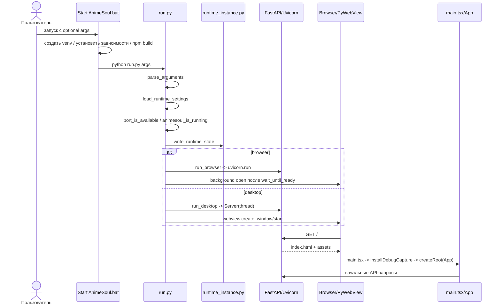
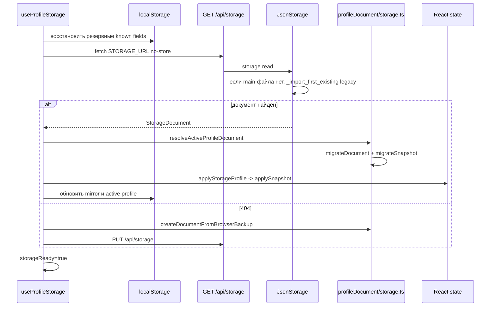
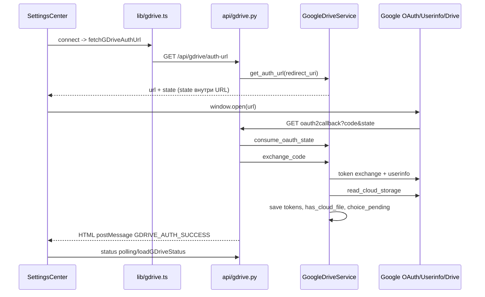

# Точки входа, выхода и цепочки функций AnimeSoul

Документ показывает не только файлы запуска, но и фактический путь вызовов от
действия пользователя до внешнего эффекта и обратно.

## Точки входа процесса

| Точка | Файл/символ | Когда используется | Выход |
| --- | --- | --- | --- |
| корневой BAT | `Start AnimeSoul.bat` | обычный source-запуск из корня | вызывает `app/Start AnimeSoul.bat` |
| основной BAT | `app/Start AnimeSoul.bat` | source runtime | venv → pip → npm → build → `run.py` |
| browser BAT | `app/Start AnimeSoul in Browser.bat` | принудительный browser | `run.py --mode browser` |
| desktop BAT | `app/Start AnimeSoul Desktop.bat` | принудительный PyWebView | `run.py --mode desktop` |
| configure BAT | `app/Configure AnimeSoul.bat` | повторная настройка | `run.py --configure` |
| runtime CLI | `app/run.py::main()` | source и packaged runtime | Uvicorn + browser/PyWebView |
| packaged launcher | `app/launcher.py::main()` | Windows installer shortcut | WebView UI + `LauncherApi` |
| ASGI | `app/backend/app/main.py::app` | Uvicorn, dev или tests | FastAPI routes/static SPA |
| HTML | `app/frontend/index.html` | загрузка SPA | `/src/main.tsx` или built bundle |
| React | `app/frontend/src/main.tsx` | browser/WebView | debug capture + `<App />` |
| transfer CLI | `python -m tools.transfer_saves` | ручной перенос | validated atomic copy + backup |

## Точки входа FastAPI

На import `backend.app.main`:

1. `config.settings = load_settings()` вычисляет все пути и tokens.
2. Router modules создают singleton services для текущего data directory.
3. `FastAPI(...)` и CORS middleware создаются в `main.py`.
4. Подключаются routers Yummy, storage, party, gdrive, ratings.
5. Регистрируется `/api/health`.
6. Если `frontend/dist` существует, монтируются `/assets` и SPA catch-all.

HTTP/WS точки перечислены в [`API_REFERENCE.md`](API_REFERENCE.md).

## Выходы и завершение

### Коды процесса `run.py`

| Код | Где возникает | Причина |
| --- | --- | --- |
| `0` | обычный return/закрытие | нормальное завершение или открытие уже работающего instance |
| `2` | `load_runtime_settings` | повреждённый/не-object JSON config |
| `3` | `main` | занятый порт и не найден свободный в следующих 100 user ports |
| `4` | `open_existing_client`/`run_desktop` | для desktop не импортируется `webview` |
| `5` | `run_desktop` | FastAPI не ответил за 100 × 0.12 с |

При занятом configured port код 3 не возникает сразу: если там AnimeSoul,
открывается второй client; если другое приложение, `find_available_port`
начинает с `port + 1` и сохраняет первый свободный.

### Нормальное завершение runtime

- Browser mode: Uvicorn работает в foreground до сигнала завершения.
- Desktop mode: закрытие WebView запускает `finally`, устанавливает
  `server.should_exit = True` и ждёт thread до 5 секунд.
- Внешний `finally` `run.py::main` вызывает
  `remove_runtime_state(CONFIG_FILE, instance_id)`.
- Launcher может принудительно остановить только PID, чей instance ID совпал с
  `/api/health` и runtime state.
- `WebSocketDisconnect` удаляет socket из `room.sockets`.
- React effects очищают свои timers/listeners через cleanup functions.

### Выходы данных

| Действие | Выход |
| --- | --- |
| локальное сохранение | `data/animesoul-storage.json` через temp + replace |
| export profile | browser download `AnimeSoul-<profile>.json` |
| полный transfer | destination JSON + optional timestamped backup |
| Google sync | `AnimeSoul/animesoul-storage.json` или Drive `appDataFolder` |
| community vote | SQLite row или delete по `(voter_id, anime_id)` |
| Watch Party | состояние только в памяти процесса + optional WS snapshots |
| diagnostics | `localStorage` debug log и экспорт через DebugPanel |

## Цепочка 1: source-запуск



Точная функция выбора готовности — `wait_until_ready`, проверяющая
`/api/health`. Повторный запуск распознаётся по `ok` и
`stack === "FastAPI + React"`.

## Цепочка 2: packaged launcher

```text
AnimeSoul Launcher.exe
-> launcher.main
-> webview.create_window(LAUNCHER_HTML, js_api=LauncherApi)
-> JS pywebviewready
-> LauncherApi.get_settings + get_server_status
-> пользователь: save / launch / stop_server
```

Запуск нового runtime:

```text
LauncherApi.launch
-> _validate_port / port_is_available / existing_animesoul
-> при конфликте find_available_port
-> _validate_fields -> validate_public_token (GET api.yani.tv/anime?limit=1)
-> save_settings
-> runtime_command
-> subprocess.Popen(AnimeSoul Runtime.exe или run.py)
-> write_runtime_state(instance_id, pid, port, mode)
-> UI polling get_server_status
```

Если server уже работает, `_open_running_server` открывает ещё один browser или
desktop client и не создаёт второй FastAPI process.

## Цепочка 3: React bootstrap и выбор экрана

```text
index.html#root
-> main.tsx
   -> installDebugCapture
   -> import globals.css
   -> createRoot(...).render(<StrictMode><App /></StrictMode>)
-> App.Home()
   -> useProfileStorage
   -> useCatalogController
   -> useCommunityRatings
   -> useWatchPartyPresence
   -> useApiActivity
   -> useEpisodeTracking
   -> useCatalogPresentation / useResumePreview / library selectors
-> render Header + текущая Page + modals/footer
```

`ApplicationView` принимает `home`, `catalog`, `stats`, `ratings`. Просмотр
тайтла задаётся отдельно через `active: Anime | null`; при active рендерится
`Watch` (`components/Player.tsx`). Открытая folder/collection/modal — также
ортогональное состояние, а не URL router.

## Цепочка 4: первоначальная загрузка сохранения



Главные функции:

```text
hydrateFileStorage
-> resolveActiveProfileDocument
-> applyStorageProfile
-> applySnapshot
```

`storageEnvelopeRef` удерживает неизвестные root fields для следующей записи.

## Цепочка 5: автоматическое сохранение профиля

Любое изменение перечисленных dependencies (`favorites`, `folders`, `progress`,
`ratings`, `tracked`, theme/prefs/history/layout/profile) запускает effect:

```text
React state change
-> useProfileStorage effect
-> setSaveStatus(saving)
-> debounce 400 ms
-> makeSnapshot
   -> buildProfileSnapshot
   -> migrateSnapshot
-> upsertProfile
-> makeDocument
   -> buildStorageDocument
   -> migrateDocument
-> write local profiles mirror
-> saveStorageDocument
   -> определить auto_sync из localStorage cloud guard
   -> PUT /api/storage?auto_sync=true|false
-> api.storage.write_storage
   -> JsonStorage.write
      -> asyncio.Lock
      -> animesoul-storage.tmp.json
      -> replace animesoul-storage.json
   -> optional GoogleDriveService.schedule_write
-> setSaveStatus(saved|error)
-> usePublishedSaveStatus -> event + localStorage -> Header
```

Один debounce отменяет предыдущий timer при следующем изменении. Backend Drive
queue дополнительно coalesce несколько документов.

## Цепочка 6: каталог и поиск

```text
CatalogPage/Header input
-> useCatalogController.setQuery
-> через 120 ms prefetchCatalogSearch
-> features/catalog/api.cachedCatalogSearch
-> GET /api/yummy?mode=catalog&q=...&limit=24&offset=0
-> api.yummy.yummy_proxy
-> YummyAnimeGateway.search
   -> anime_search_queries
   -> параллельные _request /anime
   -> первая непустая страница
   -> cache 5 min
-> Anime[]
-> controller uniqueAnime
-> useCatalogPresentation
-> AnimeCard[]
```

Явная загрузка без query проходит через `fetchCatalogPage -> requestCatalogPage`
и upstream `/anime`. `loadMore` может выполнить до пяти страниц по 48, пока не
получит 12 новых карточек после franchise filters.

Сохранённые ID, которых нет в catalog, восстанавливаются цепью:

```text
storedIds -> fetchAnimeDetails
-> /api/yummy?mode=details&ids=...
-> Promise.all upstream /anime/{id}
-> catalog merge
```

## Цепочка 7: открытие тайтла и загрузка плеера

```text
AnimeCard/onOpen
-> App setActive(anime)
-> render Watch
-> fetchFamily(anime)
   -> при viewing_order использовать его
   -> иначе details/search fallback через /api/yummy
-> groupFranchises / SeasonGroup[]
-> Player.fetchVideos
   -> для каждого entry до 4 попыток GET mode=videos&id=...
   -> нормализовать originAnimeId/originNumber/contentKind/contentTitle
   -> offset episode numbers внутри группы
   -> dedup по video_id
-> PlayerToolbar + SeasonList + iframe
```

Источник iframe проходит через `lib/kodik.ts`. Для Kodik URL добавляются
параметры серии/startAt и обрабатываются provider `postMessage`; другие iframe
гарантируют только встраивание.

## Цепочка 8: progress, ручная отметка и tracking acknowledge

```text
iframe/player event или SeasonList toggle
-> Player строит AnimeProgress/EpisodeState
-> createActiveWatchActions(...).updateProgress
-> определить changedKeys и newlyWatched через isEpisodeWatched
-> setProgress immutable update + writeLocal(progress)
-> если серия только что просмотрена и есть tracker:
   originKeys.reduce(acknowledgeTrackedEpisode)
   -> setTracked + writeLocal(tracked)
-> useProfileStorage debounce-save полного документа
```

`toggleEpisodeWatched` хранит/восстанавливает `manualPrevious`. Естественное
завершение, повторный просмотр и auto-next остаются отдельными решениями player.

## Цепочка 9: отслеживание новых серий

```text
App -> useEpisodeTracking(tracked)
-> check сразу и setInterval 300000 ms
-> для каждой записи, если lastCheckedAt старше 240000 ms:
   fetchTrackingSnapshot
   -> resolveFranchiseAnimeIds
      -> GET mode=details&ids=seed
      -> seed + viewing_order anime IDs
   -> последовательно для каждого ID GET mode=videos
   -> collectPlayableEpisodeDates(selected dubs)
   -> collectPlayableEpisodeDates(all dubs)
-> если successfulRequests > 0:
   reconcileTrackedEpisodes
-> setTracked + localStorage mirror
-> useProfileStorage save
```

Отмена component effect проверяется между запросами. Один неуспешный сезон не
останавливает остальные, но полностью неуспешный snapshot игнорируется.

## Цепочка 10: личная и общая оценка

Локальное изменение:

```text
ScorePicker
-> App handleRatingChange
-> setUserRating(current, title, target, value)
-> saveRatings -> localStorage mirror
-> useProfileStorage -> PUT storage
```

Публикация aggregate:

```text
personalRatings updatedAt изменился
-> useCommunityRatings effect (debounce 500 ms)
-> publishCommunityRating
-> PUT /api/community-ratings/{animeId}
-> publish_community_rating validation
-> CommunityRatingStore.replace
   -> INSERT ... ON CONFLICT UPDATE или DELETE пустого дерева
-> aggregate
-> frontend communityRatings state
-> published updatedAt marker
```

При offline error публикация повторяется через 30 секунд. Удаления хранятся в
отдельной localStorage tombstone queue.

Чтение:

```text
animeIds -> fetchCommunityRatings (chunks по 100)
-> GET /api/community-ratings?ids=...
-> SQLite aggregate -> CommunityRatings map
```

## Цепочка 11: Watch Party

Создание/вход:

```text
WatchPartyPanel
-> useWatchParty.createRoom|joinRoom
-> postWatchParty(/create|/join)
-> WatchPartyService.create|join
-> assertCompatibleWatchPartyProtocol(2)
-> saveWatchPartySession(sessionStorage)
```

Основной цикл раз в секунду:

```text
useWatchParty.tick
-> определить suppressingRemotePlayback
-> playbackReachedTarget / playbackChangedByUser
-> POST /watch-party/update {session,name,mode,roomMode,playback,control}
-> WatchPartyService.update -> broadcast optional WS
-> GET /watch-party/state
-> assert protocol + normalizeParty
-> найти self/обновить role
-> roomPlaybackRevision
-> если новая чужая command и follow policy:
   suppressControlUntil = now + 12s
   lastLocalPlayback = remote playback with local updatedAt anchor
   onHostState(remote playback)
```

Guard не даёт применённой remote-команде вернуться на server как новая local
seek/play command. REST polling — авторитетный путь; WS в текущем hook не
создаётся.

## Цепочка 12: Google OAuth



Header poll status выполняется сразу и каждые 2.5 секунды; Settings modal
добавляет собственный polling с тем же интервалом, пока открыт.

## Цепочка 13: Google Drive sync и autosave

Явная команда:

```text
CloudSettings/useGoogleDriveSettings.syncNow(mode)
-> confirm для cloud/local destructive direction
-> lib/gdrive.syncGDrive
-> POST /api/gdrive/sync
-> mark_sync_started
-> _sync_drive_impl
   -> local_storage.read
   -> read_cloud_storage(folder_mode)
   -> upload/download/merge/anime_only branch
   -> optional merge_storage_documents
   -> local_storage.write + write_cloud_storage
-> mark_sync_succeeded|failed
-> frontend onStorageReload
-> useProfileStorage.reloadStorage/applyStorageProfile
```

Мгновенный autosave:

```text
PUT /api/storage?auto_sync=true
-> shared GoogleDriveService.schedule_write
-> pending document replace/coalesce
-> worker:
   latest local read
   -> cloud read
   -> merge_storage_documents
   -> cloud write
   -> если не пришёл более новый local save, local write merged
```

Interval autosave:

```text
Header effect (Drive connected)
-> read interval minutes
-> setInterval
-> если mode === interval:
   syncGDrive("merge", preferWatched, folderMode)
   -> reload storage/status
```

Manual mode не запускает PUT autosync или interval callback; синхронизация
происходит по кнопке.

## Цепочка 14: import/export и полный transfer

Экспорт одного профиля:

```text
ProfileSettings -> useProfileStorage.exportConfig
-> makeSnapshot(active name)
-> JSON.stringify UTF-8 browser Blob
-> Object URL -> anchor download -> revoke URL
```

Импорт одного профиля:

```text
file input -> importConfig
-> file.text -> JSON.parse
-> migrateSnapshot
-> запрос имени -> новый crypto.randomUUID profile
-> сохранить текущий active snapshot
-> build/save document
-> optional switch -> applySnapshot + location.reload
```

Полный transfer:

```text
tools.transfer_saves.main
-> paths_for(to-main|to-legacy)
-> read_document source + validate profiles list
-> backup_file existing destination
-> copy_document через temp + replace
```

Источник не изменяется.

## Цепочка 15: применение стилей

```text
main.tsx
-> import globals.css
-> @import styles/base.css
   -> ordered base-*.css modules
-> library.css -> player.css -> system-panels.css -> home-redesign.css -> ratings.css
-> useProfileStorage theme effect
   -> --accent / --accent-soft / --bg
   -> data-color-scheme / colorScheme / body background
-> useProfileStorage playerPrefs effect
   -> --watched-episode-color
   -> --interface-font-scale / --heading-font-scale
   -> --poster-scale / --preview-scale
-> optional run.py DESKTOP_ZOOM_SCRIPT
   -> documentElement.style.zoom
```

CSS cascade и inline surfaces подробно описаны в [`STYLES.md`](STYLES.md).
