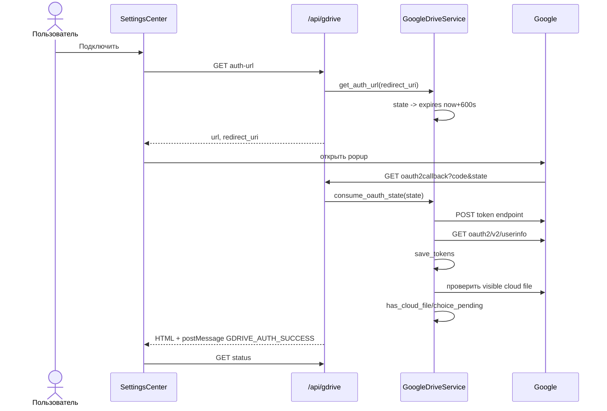

# Синхронизация AnimeSoul с Google Drive

Документ описывает фактическую реализацию `backend/app/services/gdrive.py`,
`gdrive_merge.py`, `api/gdrive.py` и frontend-клиента версии 0.2.6.

## Назначение и границы

Google Drive хранит копию полного `StorageDocument`: профили, библиотеку,
прогресс, личные оценки и переносимые настройки. OAuth tokens, community
ratings, runtime state и browser-only UI state в cloud document не входят.

Поддерживаются два расположения:

| `folder_mode` | Расположение | Drive API space |
| --- | --- | --- |
| `visible` | папка `AnimeSoul/animesoul-storage.json` в корне пользователя | `drive` |
| `appdata` | скрытый `appDataFolder/animesoul-storage.json` | `appDataFolder` |

Файл передаётся по HTTPS средствами Google API. AnimeSoul не добавляет
прикладное шифрование содержимого поверх транспорта.

## Файлы текущего устройства

| Файл data-каталога | Содержимое |
| --- | --- |
| `gdrive-credentials.json` | `client_id`, optional `client_secret` |
| `gdrive-tokens.json` | `access_token`, optional `refresh_token`, `expires_at`, user info и cached sync flags |
| `animesoul-storage.json` | локальная сторона синхронизации |

Эти файлы не входят в Git. Credentials и tokens сохраняются как локальный JSON,
поэтому data-каталог должен оставаться доступным только пользователю устройства.

## Архитектурная цепочка

```text
CloudSettings / Header
-> useGoogleDriveSettings / lib/gdrive.ts
-> /api/gdrive/*
-> api/gdrive.py
-> shared GoogleDriveService(data_dir)
   ├─ Google OAuth/Userinfo
   ├─ Google Drive REST v3
   └─ gdrive_merge.py (pure policy)
-> JsonStorage для локальной стороны
```

`get_gdrive_service(data_dir)` возвращает один singleton на разрешённый
data-каталог. Это гарантирует одну lock/queue; отдельные service instances могли
бы загрузить stale документ последним.

## Credentials

Приоритет `get_client_credentials()`:

1. `gdrive-credentials.json`; понимает также Google-форму
   `{"installed": {"client_id": ..., "client_secret": ...}}`;
2. `GOOGLE_CLIENT_ID`/`GOOGLE_CLIENT_SECRET` или поля машинного config;
3. пустые defaults.

`POST /api/gdrive/credentials` принимает:

```json
{"client_id": "...", "client_secret": null}
```

Пустой/отсутствующий secret сохраняет ранее записанное значение. Смена уже
существующего Client ID или resolved secret отключает старый account, удаляя
tokens. Secret никогда не возвращается через status API.

## OAuth flow

Реализация использует стандартный OAuth 2.0 authorization code flow с
одноразовым `state`. PKCE `code_challenge`/`code_verifier` в текущем коде нет.

Запрашиваемые scopes:

```text
https://www.googleapis.com/auth/drive.file
https://www.googleapis.com/auth/drive.appdata
https://www.googleapis.com/auth/userinfo.email
```

Дополнительно отправляются `access_type=offline` и `prompt=consent`, чтобы
получить refresh token.



`state` хранится только в памяти процесса, действует 10 минут и потребляется
один раз. Restart backend делает незавершённый callback недействительным.

После обмена code сервис сохраняет `expires_at = now + expires_in`, email/name,
проверяет cloud file в default `visible` режиме и выставляет:

- `has_cloud_file=true`, если файл найден;
- `choice_pending=true`, если найденный файл требует первого решения;
- оба `false`, если файла нет или inspection завершился ошибкой.

Callback возвращает HTML popup. При успехе он отправляет opener event
`{type: "GDRIVE_AUTH_SUCCESS"}` только на текущий backend origin. Settings modal
также опрашивает status каждые 2.5 секунды, пока открыт.

## Refresh token

`get_valid_access_token()` возвращает текущий access token, если до истечения
больше 60 секунд. Иначе при наличии refresh token вызывает Google token endpoint
с `grant_type=refresh_token`, обновляет `access_token`/`expires_at` и сохраняет
JSON. При сетевой ошибке функция логирует warning и возвращает старый token,
после чего последующий Drive request может завершиться HTTP error.

## Работа с Drive API

### Visible mode

1. `_get_folder` ищет folder с именем `AnimeSoul`, нужным mime type и
   `trashed=false` в space `drive`.
2. При записи и отсутствии папки создаёт её.
3. Внутри папки ищет `animesoul-storage.json`.
4. Чтение использует `GET /drive/v3/files/{id}?alt=media`.
5. Существующий файл обновляется media `PATCH`, новый создаётся multipart
   `POST` с metadata и JSON content.

### Appdata mode

Вместо folder ID используется специальный parent `appDataFolder`, search space
`appDataFolder`. Пользователь не видит файл в обычном интерфейсе Drive.

При нескольких файлах с одинаковым именем сервис использует первый элемент
ответа Google; отдельной дедупликации в текущей версии нет.

## API

Полные поля/ошибки приведены в [`API_REFERENCE.md`](API_REFERENCE.md). Кратко:

| Метод | Путь | Назначение |
| --- | --- | --- |
| `GET` | `/api/gdrive/status` | connection, credentials, cloud flags, sync lifecycle |
| `POST` | `/api/gdrive/credentials` | локально сохранить OAuth client |
| `GET` | `/api/gdrive/auth-url` | сформировать Google URL и state |
| `GET` | `/api/gdrive/oauth2callback` | принять `code`/`state`, вернуть HTML |
| `POST` | `/api/gdrive/sync` | выполнить выбранную стратегию |
| `POST` | `/api/gdrive/disconnect` | удалить tokens |

`disconnect` не отзывает grant через Google revoke endpoint и не удаляет cloud
file/credentials; он удаляет локальный `gdrive-tokens.json`.

## Режимы явной синхронизации

Body:

```json
{
  "mode": "merge",
  "prefer_watched": true,
  "folder_mode": "visible"
}
```

| Mode | Действие | Локальная сторона | Cloud сторона |
| --- | --- | --- | --- |
| `local` | принудительная выгрузка | не меняется | полностью заменяется local document |
| `cloud` | принудительное восстановление | полностью заменяется cloud document | не меняется |
| `merge` | обычное объединение | получает merged document | получает тот же merged document |
| `anime_only` | merge с локальным приоритетом UI prefs | получает merged document | получает merged document |
| `auto` | upload, если cloud пуст; иначе merge | зависит от ветки | зависит от ветки |

`cloud` без найденного файла возвращает нестандартный HTTP `444`. `local` и
`cloud` — направления с полной заменой одной стороны; frontend требует confirm.

Успех имеет `status: uploaded|downloaded|merged`, optional `file_id` и полный
`document`.

## Как выбирается «новый» документ

`_document_timestamp` читает `StorageDocument.updatedAt`:

- number используется напрямую;
- ISO string разбирается через `datetime.fromisoformat`;
- отсутствующее/невалидное значение даёт `0`.

Если хотя бы одна сторона имеет timestamp, `collection_source` равен local при
`local_time >= cloud_time`, иначе cloud. Эта сторона определяет membership и
deletion-sensitive collections. Это важно: merge не является безусловным
union всех списков.

## Правила merge документа

### Envelope и profiles

- неизвестные root fields берутся из более нового document поверх старого;
- `schemaVersion` — максимум двух значений, default 1;
- `updatedAt` — значение выбранного нового document;
- при обычном timestamped merge список profile IDs берётся из нового document,
  чтобы удалённый профиль не воскрес;
- при `anime_only` или отсутствии timestamps profile IDs объединяются;
- одинаковые profile ID передаются в `merge_profile`;
- несуществующий `activeProfile` заменяется первым merged profile ID.

Внутри profile неизвестные fields также имеют приоритет выбранной стороны. В
`anime_only` локальный profile/snapshot имеет верхний приоритет даже когда cloud
document новее; это защищает локальные UI preferences.

### Favorites

- при выбранном `collection_source` берётся список этой стороны целиком;
- без timestamps применяется sorted union.

Так сохраняется удаление favorite из более нового полного документа.

### Folders и notes

- membership/order берутся из `collection_source` (без timestamps — local как
  базовый с добавлением отсутствующих cloud folders);
- folders сопоставляются по `id`;
- при timestamped merge `animeIds` folder берутся от source, чтобы удаления не
  возвращались;
- без source `animeIds` объединяются;
- `notes` объединяются, но значение source folder побеждает для одинакового ID.

### Tracking

- membership подписок берётся из нового полного document; без timestamps
  добавляются обе стороны;
- `animeIds`, `knownEpisodeKeys`, `knownAnyEpisodeKeys` объединяются;
- `knownEpisodes` — максимум count и длины merged known keys;
- при timestamped merge `dubs`, pending keys и other-dub pending берутся от
  source; без source объединяются;
- `newEpisodes`/`otherDubEpisodes` пересчитываются по pending arrays;
- `lastCheckedAt` и `lastNewEpisodeAt` — maximum.

### Progress

Anime IDs и episode keys всегда объединяются. Для каждого anime:

1. На каждой стороне находится максимальный `EpisodeState.updatedAt`.
2. Метаданные `AnimeProgress` (`episode`, `dub`, season и др.) получают приоритет
   стороны с более поздней серией; при равенстве local.
3. Каждая серия объединяется `_merge_episode_state`.

Episode policy:

- общие fields приходят из более нового `updatedAt` record;
- при `prefer_watched=true` `completed` и `manuallyCompleted` вычисляются через
  OR, то есть просмотренное состояние не теряется;
- `completionHistory` — уникальное sorted объединение;
- `completions`, `watchedSeconds`, `duration` — maximum;
- современный `position` остаётся от более нового record, поэтому перемотка
  назад сохраняется;
- legacy field `time`, если присутствует, берётся как maximum.

При `prefer_watched=false` completed flags не получают OR и следуют более
новому episode record.

### Ratings

- при timestamped document merge целиком берётся ratings map выбранного
  `collection_source`, чтобы удаление rating не воскресало;
- только при отсутствии обоих document timestamps anime IDs объединяются, а
  при конфликте побеждает больший `AnimeUserRatings.updatedAt` (при равенстве
  local).

### Titles и hidden list

- `animeTitles` объединяется; source side побеждает, а в `anime_only` local
  всегда имеет приоритет;
- `progress[animeId].title` затем записывается в `animeTitles`;
- `watchingHidden` берётся от source или объединяется без timestamps.

### `anime_only`

Дополнительная гарантия режима:

- локальные `playerPrefs` сохраняются, если были;
- локальная `theme` сохраняется, если была;
- остальные неизвестные/обычные snapshot fields также начинают с локального
  приоритета, но collection/progress правила выше всё равно выполняются.

Название режима не означает «скопировать только progress»: результат остаётся
полным StorageDocument. Режим предназначен для переноса библиотеки и статистики
без замены локальной темы и player preferences.

## Автосинхронизация

Frontend хранит режим в localStorage:

| Значение | Реальное поведение |
| --- | --- |
| `instant` | `saveStorageDocument` добавляет `auto_sync=true` к каждому debounced PUT, если initial choice завершён |
| `interval` | PUT остаётся локальным; `Header.tsx` запускает `syncGDrive("merge")` каждые 1/5/15/30/60 минут |
| `manual` | автоматическая отправка не запускается; доступны явные кнопки |

Локальный JSON сохраняется во всех режимах.

### Backend instant queue

`api/storage.py` после успешной локальной записи вызывает общий
`GoogleDriveService.schedule_write`, если query `auto_sync=true` и tokens
существуют.

Queue:

1. Копирует document в `_pending_document`; следующий save заменяет pending.
2. Если worker уже работает, новый task не создаётся.
3. Worker перечитывает latest local и сравнивает `updatedAt`.
4. Читает cloud, выполняет `merge_storage_documents`, пишет cloud.
5. Пишет merged local только если во время сети не пришёл более новый save.
6. При новом pending повторяет цикл.
7. При ошибке сохраняет latest pending для следующей попытки и публикует
   `last_sync_error`.

Status fields `sync_running`, `sync_pending`, `last_sync_started_at`,
`last_sync_at`, `last_sync_error` позволяют UI отличить локально сохранённые
данные от подтверждённой cloud-загрузки.

### Initial choice guard

После подключения account с существующим visible cloud file backend ставит
`choice_pending=true`. Frontend записывает
`animesoul:gdrive-initial-choice-done=false`, показывает blocking modal и не
включает instant autosync до явного выбора.

Это client-side guard. Сам `PUT /api/storage?auto_sync=true` доверяет query и не
проверяет `choice_pending`; сторонний caller обязан соблюдать тот же протокол.

## Состояние в UI

`GET status` возвращает:

- connection/user/credentials/cloud flags;
- `sync_state: idle|syncing|synced|error`;
- running/pending booleans;
- timestamps и last error.

Header загружает status сразу и каждые 2.5 секунды всё время, пока смонтировано
приложение. Settings modal запускает собственный такой же polling на время
открытия. Header также запускает interval mode и открывает initial choice через
typed event `open-gdrive-choice`.

После `uploaded/downloaded/merged` frontend вызывает `reloadStorage`, чтобы
React state соответствовал записанному документу.

## Ошибки и восстановление

- OAuth state invalid/expired: повторить подключение; старый popup использовать
  нельзя.
- Нет credentials: сохранить Client ID через settings.
- Нет tokens: sync возвращает 401.
- Cloud restore без файла: 444; локальные данные до записи не меняются.
- Ошибка instant worker: локальный файл уже сохранён, pending остаётся для
  следующей попытки.
- Неверный cloud JSON может пройти Drive read, но дальнейшая миграция frontend
  применит defaults; перед ручной заменой сохраняйте локальный export/backup.

## Проверка изменений

Минимум:

```powershell
cd app
.\.venv\Scripts\python.exe -m unittest backend.tests.test_gdrive -v
npm --prefix frontend run typecheck
npm --prefix frontend run build
```

Для изменения policy добавляйте tests двух конфликтующих документов, включая
deletion, разные `updatedAt`, `prefer_watched` и `anime_only`. Для OAuth/Drive
I/O не смешивайте pure merge tests с реальными credentials.
