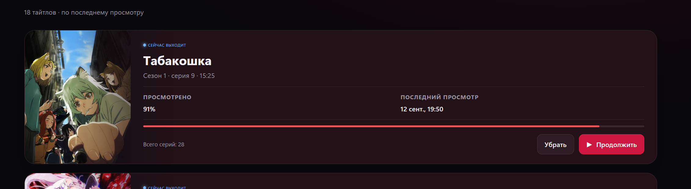

[English](SCREENSHOTS.md) | [Русский](SCREENSHOTS.ru.md)

# Галерея скриншотов

[Проект](../../README.ru.md) · [Реализация UI](UI.ru.md)

## Библиотека Windows

Выше сохранён существующий снимок, добавленный владельцем в GitHub README. Предыдущий локальный снимок из репозитория:

## Настройки просмотра и оформления

Эти два снимка сделаны 16 сентября 2026 года из свежей React-сборки 0.2.7, раздаваемой FastAPI в браузере. Использован отдельный пустой профиль Demo и data-каталог без подключённого Drive, viewport браузера 1280×720. Это реальный интерфейс, не сгенерированные макеты. На снимках нет ключей, личной библиотеки и debug-журналов. UI остаётся русским в обеих версиях документации.

## Android

  
  

Существующие Android-снимки сохранены из репозитория; в рамках этого обновления новые снимки с устройства не делались. Мини-плеер остаётся смонтированным при переходе между разделами; системный PiP — отдельный режим.

## Обновление изображений

Используйте демонстрационный профиль и отдельные данные, соберите frontend нужной платформы, откройте реальный UI, дождитесь отрисовки и снимите его без дорисовки элементов. Избегайте экранов ключей, облачного аккаунта и debug. Укажите дату, версию, платформу и viewport. Храните понятные имена в screenshots/, подписи и alt на обоих языках. Адаптивный desktop-снимок нельзя выдавать за снимок нативного Android-устройства.
