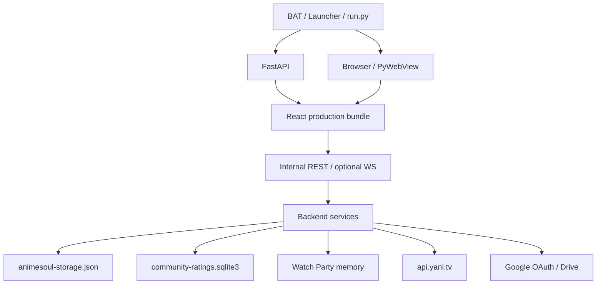

# Техническая документация AnimeSoul

Актуально для версии **0.2.4**, реализация `app/`. Документ является обзорной
точкой входа; детальные контракты вынесены в специализированные справочники,
чтобы поля API, данные и CSS имели по одному владельцу документации.

## Навигация

| Нужно узнать | Документ |
| --- | --- |
| что и где находится | [`PROJECT_MAP.md`](PROJECT_MAP.md) |
| как устроены слои и зависимости | [`../ARCHITECTURE.md`](../ARCHITECTURE.md) |
| откуда начинается и где заканчивается выполнение | [`ENTRY_POINTS_AND_FLOWS.md`](ENTRY_POINTS_AND_FLOWS.md) |
| какие функции вызывают друг друга | [`ENTRY_POINTS_AND_FLOWS.md`](ENTRY_POINTS_AND_FLOWS.md) |
| все REST/WS поля | [`API_REFERENCE.md`](API_REFERENCE.md) |
| какие поля YummyAnime реально используются | раздел upstream fields в [`API_REFERENCE.md`](API_REFERENCE.md#реально-используемые-поля-yummyanime) |
| схема JSON, progress, settings и localStorage | [`DATA_MODEL.md`](DATA_MODEL.md) |
| где лежат и как применяются стили | [`STYLES.md`](STYLES.md) |
| как работает OAuth/Drive merge | [`GDRIVE_SYNC.md`](GDRIVE_SYNC.md) |
| как переносить данные в legacy и обратно | [`../SAVE_COMPATIBILITY.md`](../SAVE_COMPATIBILITY.md) |
| что осталось рефакторить | [`REFACTORING_RECOMMENDATIONS.md`](REFACTORING_RECOMMENDATIONS.md) |

## Назначение системы

AnimeSoul объединяет четыре локальные ответственности:

1. React SPA показывает каталог, библиотеку, плеер, оценки, статистику и
   настройки.
2. FastAPI скрывает upstream token, проксирует YummyAnime и обслуживает
   внутренние функции.
3. Локальные сервисы сохраняют профили, общие оценки и комнаты просмотра.
4. Runtime/launcher поднимает тот же backend для браузера или PyWebView.

Внешние источники:

- YummyAnime — каталог, метаданные, видео, трейлеры и расписание;
- Google OAuth/Drive — optional cloud copy;
- Kodik private API — прямые HLS-варианты, субтитры и skip-сегменты;
- iframe-провайдеры из ответа каталога — резервное воспроизведение.

AnimeSoul может хранить явно скачанные пользователем видеофайлы. Приватный ключ
Kodik защищается Windows DPAPI и не выдаётся frontend; браузер получает только
временную прямую ссылку на выбранную серию.

## Технологии

| Слой | Стек | Корневая точка |
| --- | --- | --- |
| runtime | Python, Uvicorn, PyWebView | `app/run.py` |
| launcher | Python, PyWebView bridge | `app/launcher.py` |
| backend | FastAPI, httpx, SQLite | `app/backend/app/main.py` |
| frontend | React 19, TypeScript 5.9, Vite 8 | `app/frontend/src/main.tsx` |
| данные | JSON schema 3, localStorage mirror | `features/storage`, `lib/storage.ts` |
| стили | глобальный modular CSS | `src/globals.css` |
| packaging | PyInstaller, Inno Setup | `app/packaging/` |

## Системная схема



В dev-режиме React bundle отдаёт Vite 5173, а `/api`, `/watch-party`, `/ws`
проксируются на FastAPI 8000. В production FastAPI обслуживает и API, и SPA.

## Архитектурные слои

### Frontend

```text
App.tsx (координатор)
├─ pages/                    screen composition
├─ components/               shared UI и orchestration shells
├─ features/*/hooks          lifecycle, state, subscriptions
├─ features/*/api.ts         transport adapters
├─ features/*/selectors      чистые представления
└─ lib/                      типы, миграции и чистые domain helpers
```

`App.tsx` выбирает экран и связывает feature controllers. HTTP должен
находиться в `api.ts`/backend adapter, расчёты — в чистой функции, таймер — в
hook/effect с cleanup.

### Backend

```text
main.py
└─ api/*.py                  HTTP/WS transport и validation
   └─ services/*.py          I/O, lifecycle и policy
      ├─ external HTTP
      ├─ filesystem
      ├─ SQLite
      └─ memory rooms
```

`gdrive_merge.py` — чистая policy без I/O. Остальные services владеют своими
внешними ресурсами. Routes не должны повторять доменные правила.

## Точки входа и выхода

### Основные входы

- `Start AnimeSoul.bat` — обычный source launch;
- `run.py::main()` — runtime CLI;
- `launcher.py::main()` — GUI установленной сборки;
- `backend.app.main:app` — ASGI application;
- `frontend/src/main.tsx` — React mount;
- `tools.transfer_saves::main()` — CLI полного переноса.

### Основные выходы

- HTTP JSON/HTML/static responses;
- `animesoul-storage.json` и temp replace;
- Google Drive cloud file;
- SQLite community ratings;
- browser export JSON;
- in-memory room state/WS snapshots;
- process codes 0/2/3/4/5.

Коды, cleanup и полный вызов каждого входа:
[`ENTRY_POINTS_AND_FLOWS.md`](ENTRY_POINTS_AND_FLOWS.md).

## API-поверхность

| Подсистема | Prefix | Ключевые входные поля | Ключевые выходные поля |
| --- | --- | --- | --- |
| system | `/api/health` | — | `ok`, `stack`, `version`, optional `runtimeInstanceId` |
| storage | `/api/storage` | document, `auto_sync` | document или `saved/path` |
| Yummy proxy | `/api/yummy` | `mode`, `id/ids`, `q`, `limit`, `offset` | `anime`, `videos`, `trailers`, `schedule`, `upstreamMs` |
| ratings | `/api/community-ratings` | IDs или score tree | average/count tree |
| party | `/watch-party`, `/ws/watch-party` | session, participant, playback, control | protocol 2 room state |
| cloud | `/api/gdrive` | credentials, OAuth code/state, sync mode | status/result/HTML callback |

Полный справочник, validation, defaults, ошибки и все upstream-поля:
[`API_REFERENCE.md`](API_REFERENCE.md).

## Ключевые цепочки

| Сценарий | Сокращённая цепочка |
| --- | --- |
| запуск | BAT/launcher → `run.main` → Uvicorn → browser/WebView → `main.tsx` → `App` |
| загрузка данных | `useProfileStorage` → GET storage → `JsonStorage.read` → migrations → React state |
| сохранение | state → debounce → build snapshot/document → PUT storage → atomic write → optional Drive queue |
| поиск | `useCatalogController` → catalog API → Yummy router → gateway search variants → cards |
| player | card → `Watch` → family/details → videos → source/episode → iframe |
| progress | player event → `updateProgress` → local mirror → profile save → optional tracking acknowledge |
| tracking | hook timer → details/videos → collect dates → reconcile → save |
| rating | `ScorePicker` → local rating → storage + async community PUT → SQLite aggregate |
| party | hook tick → update → state → revision/feedback guard → player command |
| Drive | settings/header → sync → local/cloud read → pure merge → local/cloud write → reload |
| styles | `main.tsx` → `globals.css` imports → runtime CSS variables → optional desktop zoom |

Функции и условия каждой ветки приведены в
[`ENTRY_POINTS_AND_FLOWS.md`](ENTRY_POINTS_AND_FLOWS.md).

## Данные

Portable document:

```text
StorageDocument
├─ schemaVersion: 3
├─ updatedAt
├─ activeProfile
└─ profiles[]
   ├─ id / name
   └─ snapshot
      ├─ favorites / folders / notes
      ├─ progress / episode state / completions
      ├─ ratings
      ├─ tracked
      ├─ theme / toolbar / playerPrefs
      └─ history/layout fields
```

Frontend мигрирует известные поля и сохраняет неизвестные root/profile/snapshot
fields. Backend валидирует оболочку и записывает документ как opaque JSON.
Community aggregates, OAuth tokens, runtime state и debug state не входят в
portable profile. Подробности: [`DATA_MODEL.md`](DATA_MODEL.md).

## Стили

- единственный import из TS: `main.tsx -> globals.css`;
- `base.css` фиксирует порядок 13 `base-*` модулей;
- поздние feature bundles: library, player, system panels, home, ratings;
- theme устанавливает `--bg`, `--accent`, `--accent-soft` и light/dark dataset;
- player preferences устанавливают пять presentation variables;
- PyWebView zoom применяется отдельным injected script;
- launcher и OAuth callback имеют независимые inline styles.

Полная карта owners/selectors/import order: [`STYLES.md`](STYLES.md).

## Особенности и ограничения

1. YummyAnime response извлекается из upstream-поля `response`; protocol-relative
   media URL нормализуются в HTTPS.
2. Search выполняет до четырёх вариантов параллельно и кешируется на backend и
   frontend.
3. `details` ограничен 50 ID, community batch — 100 ID.
4. Watch Party комнаты живут только в памяти и теряются при restart.
5. React Watch Party использует REST polling; WebSocket endpoint не является
   текущим source of truth клиента.
6. Google OAuth использует authorization code + одноразовый in-memory state,
   но не PKCE code challenge.
7. Drive instant autosave объединяет документы, interval запускается из Header,
   manual — только по действию пользователя.
8. Полная cloud restore (`mode=cloud`) заменяет локальный document и требует UI
   подтверждения.
9. CSS глобальный; порядок импорта и specificity влияют на все экраны.
10. Собственный плеер управляет прямыми потоками Kodik; для прочих источников и
    при ошибке direct API используется provider iframe.

## Конфигурация

Основные environment overrides:

```text
ANIMESOUL_CONFIG_FILE
ANIMESOUL_PYTHON_PORT
ANIMESOUL_DATA_DIR
ANIMESOUL_FRONTEND_DIST
ANIMESOUL_INSTANCE_ID
ANIMESOUL_RUNTIME_STATE_FILE
YUMMYANIME_TOKEN
GOOGLE_CLIENT_ID
GOOGLE_CLIENT_SECRET
```

Точные приоритеты, JSON-поля и runtime-файлы: [`DATA_MODEL.md`](DATA_MODEL.md).

## Изменение подсистемы

### Новый YummyAnime field

1. Добавить optional field в `lib/types.ts`.
2. Использовать его в selector/component без прямого upstream URL.
3. Добавить field и назначение в `API_REFERENCE.md`.
4. Добавить fallback для отсутствующего значения.

### Новый внутренний endpoint

1. Route только разбирает transport и вызывает service.
2. Frontend transport помещается в feature `api.ts`/`lib` adapter.
3. Request/response/errors добавляются в `API_REFERENCE.md`.
4. Цепочка добавляется в flow doc и покрывается тестом.

### Новое сохраняемое поле

1. Тип + default/migration.
2. Snapshot builder/round-trip неизвестных полей.
3. Merge policy, если поле конфликтует между устройствами.
4. Tests и `DATA_MODEL.md`.

### Новый стиль

1. Найти owner в `STYLES.md`.
2. Проверить одинаковые selectors во всём import chain.
3. Добавить responsive/focus/light states.
4. Проверить browser/desktop/mobile/zoom.

## Проверка перед изменением контракта

```powershell
cd app
.\.venv\Scripts\python.exe -m unittest discover -s backend/tests -v
npm --prefix frontend run typecheck
npm --prefix frontend test
npm --prefix frontend run build
```

Дополнительно:

- открыть `/docs` и сверить изменённый FastAPI route;
- выполнить round-trip профиля и проверить неизвестные поля;
- для cloud изменить данные на обеих сторонах и проверить merge/delete policy;
- для CSS проверить основные breakpoints и обе схемы цвета;
- для party проверить host/shared, follow/free и отсутствие feedback loop.
