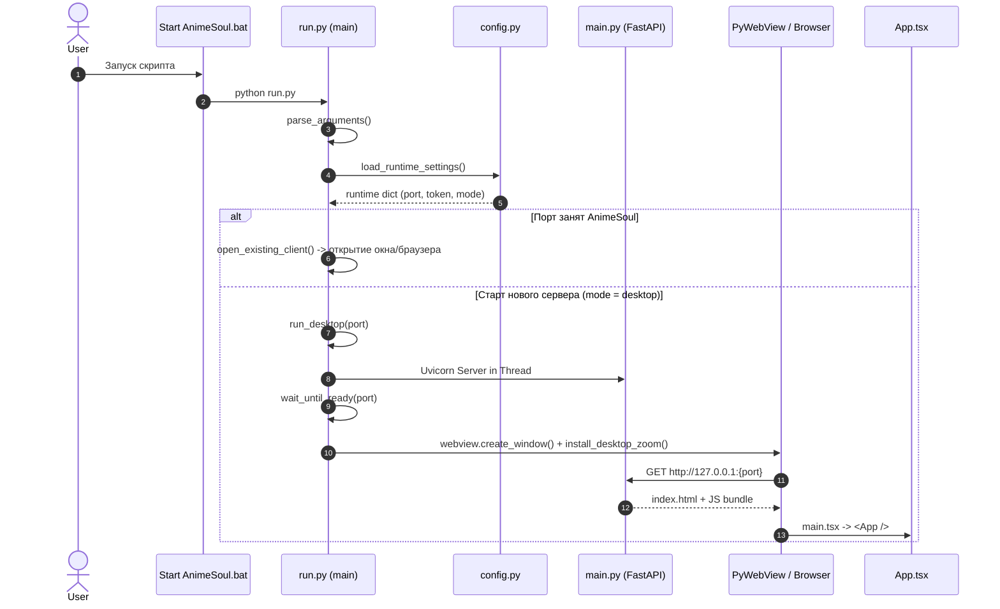
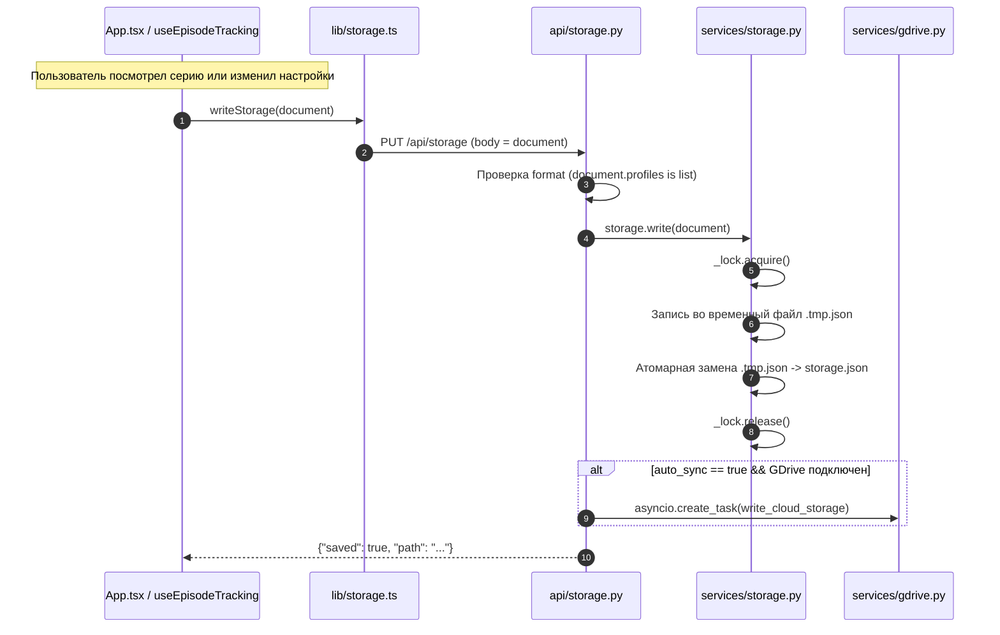
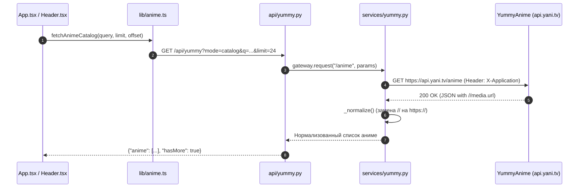
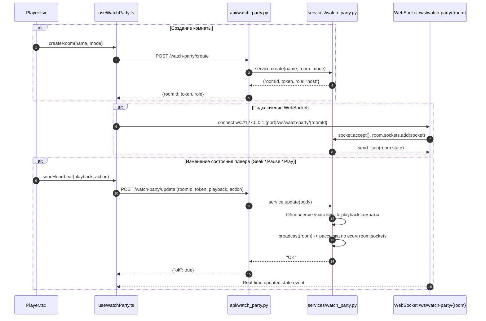
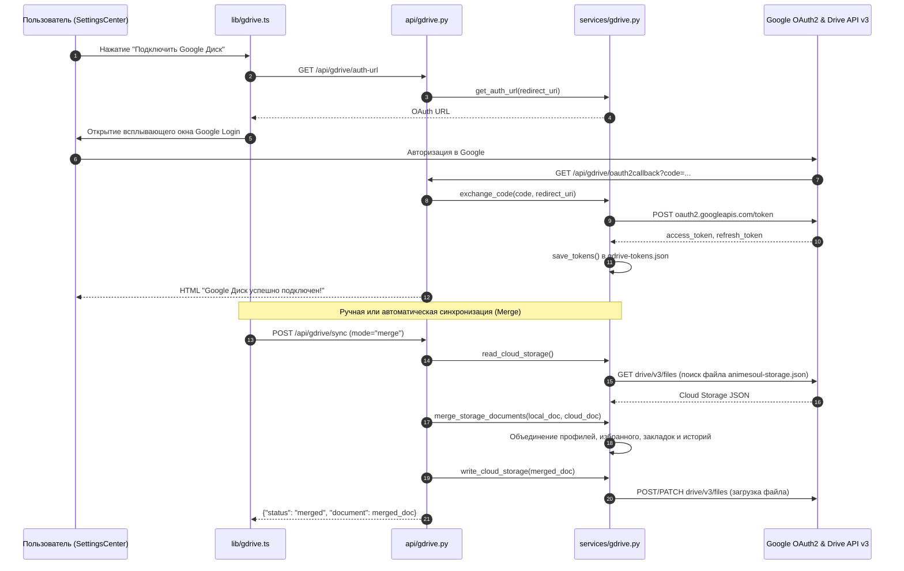

# Полная техническая документация AnimeSoul

Документ содержит исчерпывающее описание архитектуры, точек входа и выхода, цепочек функций, ответственности модулей, сетевых вызовов, переменных и структуры проекта AnimeSoul.

---

## 1. Карта структуры проекта и расположение файлов

```text
AnimeSoul/
├── Start AnimeSoul.bat                  # Главный пакетный скрипт запуска для Windows
├── app/                                 # Основная директория приложения
│   ├── ARCHITECTURE.md                  # Краткое руководство по архитектурным слоям
│   ├── SAVE_COMPATIBILITY.md            # Спецификация обратной совместимости сохранений
│   ├── Start AnimeSoul Desktop.bat      # Запуск в режиме Desktop WebView
│   ├── Start AnimeSoul in Browser.bat   # Запуск в режиме браузера
│   ├── Configure AnimeSoul.bat          # Скрипт переконфигурации ключа и порта
│   ├── run.py                           # Точка входа Python: CLI, сервер Uvicorn и PyWebView
│   ├── launcher.py                      # GUI-лаунчер на Tkinter для Windows-сборки
│   ├── animesoul.python.json            # Локальный файл конфигурации порта и токенов
│   ├── backend/                         # Backend-сервис на FastAPI
│   │   ├── app/
│   │   │   ├── main.py                  # Главный модуль FastAPI, подключение роутеров и static
│   │   │   ├── config.py                # Центр настроек (переменные окружения и JSON-конфиг)
│   │   │   ├── api/                     # Слой контроллеров (FastAPI Routers)
│   │   │   │   ├── yummy.py             # Прокси-эндпоинт к YummyAnime API
│   │   │   │   ├── storage.py           # Атомарное чтение и запись локальных сохранений
│   │   │   │   ├── watch_party.py       # REST и WebSocket эндпоинты совместного просмотра
│   │   │   │   └── gdrive.py            # OAuth2 и облачная синхронизация Google Drive
│   │   │   └── services/                # Слой бизнес-логики и внешних интеграций
│   │   │       ├── yummy.py             # Клиент HTTPX для YummyAnime API c нормализацией URL
│   │   │       ├── storage.py           # Атомарное JSON-сохранение с блокировками (asyncio.Lock)
│   │   │       ├── watch_party.py       # Управление комнатами, участниками и плеером в памяти
│   │   │       └── gdrive.py            # Google OAuth2, Google Drive REST v3 API и слияние сохранений
│   ├── frontend/                        # Frontend-приложение на React + TypeScript (Vite)
│   │   ├── index.html                   # HTML-шаблон Single Page Application
│   │   └── src/
│   │       ├── main.tsx                 # Точка входа React (ReactDOM.createRoot)
│   │       ├── App.tsx                  # Главный компонент состояния, навигации и экранов
│   │       ├── components/              # UI-компоненты
│   │       │   ├── Header.tsx           # Шапка приложения, поиск, выбор профиля
│   │       │   ├── Player.tsx           # Видеоплеер (Kodik iframe, серии, озвучки, sync)
│   │       │   ├── SettingsCenter.tsx   # Модальное окно настроек, профили, GDrive, экспорт/импорт
│   │       │   ├── CollectionOverview.tsx # Библиотека пользователя (избранное, папки, история)
│   │       │   ├── AnimeCard.tsx        # Карточка аниме в каталоге
│   │       │   ├── EpisodeHoverPreview.tsx # Превью серий при наведении
│   │       │   ├── EpisodeSlideshow.tsx # Карусель/слайд-шоу серий
│   │       │   ├── FolderPicker.tsx     # Диалог добавления аниме в пользовательские папки
│   │       │   ├── Toggle.tsx           # Переключатель UI
│   │       │   └── ReleaseMark.tsx      # Метка бета-версии
│   │       ├── hooks/                   # Кастомные хуки React
│   │       │   ├── useEpisodeTracking.ts # Авто-трекинг просмотренных серий
│   │       │   └── useWatchParty.ts     # Поллинг и WebSocket синхронизация совместного просмотра
│   │       ├── lib/                     # Модули хелперов, типы и контракты
│   │       │   ├── types.ts             # Интерфейсы TypeScript (AnimeItem, Profile, StorageDocument и др.)
│   │       │   ├── storage.ts           # Клиент работы с /api/storage и миграции профилей
│   │       │   ├── anime.ts             # Клиентские вызовы /api/yummy
│   │       │   ├── kodik.ts             # Парсинг и генерация iframe Kodik
│   │       │   ├── gdrive.ts            # Клиентские вызовы /api/gdrive
│   │       │   ├── watchPartyLogic.ts   # Хелперы для комнат Watch Party
│   │       │   └── settings.ts          # Дефолтные настройки темы и интерфейса
│   │       └── styles/                  # Таблицы стилей CSS
│   └── docs/                            # Дополнительная документация
│       ├── GDRIVE_SYNC.md               # Руководство по работе синхронизации GDrive
│       └── TECHNICAL_DOCUMENTATION.md   # Этот документ
└── legacy-old-stack/                    # Легаси-стек (хранится для миграции старых сохранений)
```

---

## 2. Точки входа и выхода (Entry & Exit Points)

### 2.1 Точки входа (Entry Points)

1. **`Start AnimeSoul.bat` / `app/Start AnimeSoul.bat`**:
   - Главная консольная точка запуска в системе Windows.
   - Запускает Python-скрипт `run.py` из локального `.venv` или глобального интерпретатора.
2. **`app/run.py` (`main()`)**:
   - Главный исполнимый файл приложения.
   - Принимает аргументы командной строки (`--mode`, `--configure`, `--config`).
   - Инициализирует конфигурацию, проверяет доступность порта, при необходимости запускает мастер настройки `ask_settings()` и поднимает либо браузерный (`run_browser`), либо desktop-режим (`run_desktop`).
3. **`app/launcher.py` (`main()`)**:
   - Точка входа GUI-лаунчера (Tkinter) для Windows-сборки (`AnimeSoulLauncher.exe`).
   - Предоставляет графическое окно настройки порта, API-токена YummyAnime и запускает фоновый процесс `run.py` / `AnimeSoulRuntime.exe`.
4. **`app/backend/app/main.py` (`app = FastAPI(...)`)**:
   - Точка входа backend-сервера FastAPI. Инициализирует CORS, регистрирует роутеры API (`yummy`, `storage`, `watch_party`, `gdrive`), монтирует статические файлы встроенного React SPA.
5. **`app/frontend/src/main.tsx`**:
   - Точка входа веб-клиента React. Рендерит компонент `<App />` в HTML-элемент `#root` файла `index.html`.

### 2.2 Точки выхода и сигналы завершения (Exit Points)

1. **Коды завершения `app/run.py`**:
   - `SystemExit(0)` — Нормальное завершение работы.
   - `SystemExit(2)` — Файл конфигурации `animesoul.python.json` повреждён или имеет невалидный JSON.
   - `SystemExit(3)` — Выбранный сетевой порт занят другим посторонним приложением (и не AnimeSoul).
   - `SystemExit(4)` — Запрошен режим `desktop`, но библиотека `pywebview` не установлена.
   - `SystemExit(5)` — FastAPI сервер не поднялся за отведённый таймаут (100 попыток / ~12 сек).
2. **Завершение фонового сервера Uvicorn (`run_desktop`)**:
   - При закрытии окна `pywebview` вызывается блок `finally: server.should_exit = True`, после чего поток сервера ждёт завершения `server_thread.join(timeout=5)`.
3. **Закрытие соединений WebSocket (`/ws/watch-party/{room_id}`)**:
   - Отключение клиента перехватывается исключением `WebSocketDisconnect`, удаляя сокет из множества `room.sockets`.

---

## 3. Цепочки функций и потоки данных (Function Call Chains)

### 3.1 Цепочка 1: Запуск и инициализация приложения



### 3.2 Цепочка 2: Чтение и атомарная запись локального сохранения (Storage Sync)



### 3.3 Цепочка 3: Запрос каталога и деталей аниме (YummyAnime Proxy)



### 3.4 Цепочка 4: Совместный просмотр (Watch Party Sync Engine)



### 3.5 Цепочка 5: Синхронизация с Google Drive



---

## 4. Зоны ответственности модулей (Responsibilities)

### 4.1 Backend (Python / FastAPI)

- **`app/run.py`**: Управление жизненным циклом процесса, аргументы CLI, проверка портов, старт сервера Uvicorn, создание окна PyWebView, инжекция скрипта масштабирования `DESKTOP_ZOOM_SCRIPT`.
- **`app/launcher.py`**: Утилита графического запуска для сборки под Windows. Сохраняет конфигурацию и запускает бинарник `AnimeSoulRuntime.exe`.
- **`backend/app/main.py`**: Маршрутизатор нижнего уровня. Объединяет REST API контроллеры, настраивает CORS и раздаёт готовый React бандл для режима продакшн.
- **`backend/app/config.py`**: Извлекает и валидирует настройки приложения из файлов `.env`, `animesoul.python.json` и переменных окружения OS.
- **`backend/app/api/yummy.py`**: Прокси-роутер. Защищает клиенты от CORS-блокировок и прячет приватные ключи YummyAnime.
- **`backend/app/api/storage.py`**: Контроллер чтения и сохранения профиля.
- **`backend/app/api/watch_party.py`**: REST + WebSocket контроллер для комнат совместного просмотра.
- **`backend/app/api/gdrive.py`**: Роутер OAuth2 коллбэков и команд синхронизации облака.
- **`backend/app/services/storage.py`**: Сервис физической записи `animesoul-storage.json`. Гарантирует целостность файлов при сбоях питания за счёт временных файлов и блокировок `asyncio.Lock()`.
- **`backend/app/services/yummy.py`**: Клиент HTTPX для сервиса YummyAnime, исправляющий неполные схемы URL (например, `//media...` -> `https://media...`).
- **`backend/app/services/watch_party.py`**: Менеджер комнат в оперативной памяти. Хранит роли, пинги участников, сменяет хостов и управляет состоянием плеера.
- **`backend/app/services/gdrive.py`**: Модуль работы с Google Drive API v3. Отвечает за поиск/создание папки `AnimeSoul`, чтение и слияние конфликтующих сохранений (`merge_storage_documents`).

### 4.2 Frontend (React / TypeScript)

- **`src/App.tsx`**: Корневой компонент. Содержит главное состояние (активный профиль, просматриваемое аниме, состояние сохранения, текущая вкладка навигации).
- **`src/components/Header.tsx`**: Верхняя панель. Поиск, логотип, статус синхронизации, быстрый выбор профиля.
- **`src/components/Player.tsx`**: Модуль воспроизведения. Формирует iframe Kodik, обрабатывает переключение серий/переводов, транслирует и принимает события Watch Party.
- **`src/components/SettingsCenter.tsx`**: Центр управления. Управление профилями, подключение Google Диска, темы оформления, ручной импорт/экспорт JSON.
- **`src/components/CollectionOverview.tsx`**: Отображение пользовательской библиотеки (избранное, пользовательские папки, история).
- **`src/hooks/useEpisodeTracking.ts`**: Автоматически регистрирует просмотренную серию при просмотре видео на определенный процент длительности.
- **`src/hooks/useWatchParty.ts`**: Автоматизирует поллинг состояния комнаты через REST и поддерживание постоянного WebSocket соединения.
- **`src/lib/storage.ts`**: Загружает, валидирует и мигрирует структуру сохранения `StorageDocument` под новые версии схемы.

---

## 5. Вызовы и сетевые эндпоинты (API Endpoint Reference)

### 5.1 System / Storage API

| Эндпоинт | Метод | Описание | Входные параметры | Ответ |
| :--- | :--- | :--- | :--- | :--- |
| `/api/health` | `GET` | Проверка доступности бэкенда | — | `{"ok": true, "stack": "FastAPI + React", "version": "..."}` |
| `/api/storage` | `GET` | Получить документ сохранения | — | JSON-объект `StorageDocument` |
| `/api/storage` | `PUT` | Сохранить документ профилей | `document: dict`, `auto_sync: bool` | `{"saved": true, "path": "..."}` |

### 5.2 YummyAnime Proxy API

| Эндпоинт | Метод | `mode` | Описание | Входные параметры |
| :--- | :--- | :--- | :--- | :--- |
| `/api/yummy` | `GET` | `catalog` | Поиск и каталог аниме | `q: str`, `limit: int`, `offset: int` |
| `/api/yummy` | `GET` | `details` | Массовые детали аниме | `ids: str` (через запятую) |
| `/api/yummy` | `GET` | `videos` | Детали и список видео | `id: int` |
| `/api/yummy` | `GET` | `schedule` | Расписание выхода серий | — |
| `/api/yummy` | `GET` | `ping` | Проверка задержки API | — |

### 5.3 Watch Party API & WebSocket

| Эндпоинт | Метод | Описание | Входные параметры | Ответ |
| :--- | :--- | :--- | :--- | :--- |
| `/watch-party/create` | `POST` | Создать новую комнату | `name: str`, `roomMode: str` | `{"roomId": "...", "token": "...", "role": "host"}` |
| `/watch-party/join` | `POST` | Войти в существующую комнату | `roomId: str`, `name: str`, `mode: str` | `{"roomId": "...", "token": "...", "role": "guest"}` |
| `/watch-party/update` | `POST` | Отправить пинг и состояние плеера | `roomId`, `token`, `playback`, `action` | `{"ok": true}` |
| `/watch-party/transfer-host` | `POST` | Передать права хоста | `roomId`, `token`, `participantId` | `{"ok": true, "hostId": "..."}` |
| `/watch-party/state` | `GET` | Получить состояние комнаты | `room: str` (Query) | JSON объекта состояния комнаты |
| `/watch-party/leave` | `POST` | Выйти из комнаты | `roomId: str`, `token: str` | `{"ok": true}` |
| `/ws/watch-party/{room_id}` | `WS` | Real-time WebSocket сокет | — | Broadcast события состояния комнаты |

### 5.4 Google Drive Sync API

| Эндпоинт | Метод | Описание | Входные параметры | Ответ |
| :--- | :--- | :--- | :--- | :--- |
| `/api/gdrive/status` | `GET` | Статус подключения Google Диска | — | `{"connected": bool, "user_email": "...", ...}` |
| `/api/gdrive/credentials` | `POST` | Сохранить свой OAuth Client ID | `client_id: str`, `client_secret: str` | `{"saved": true}` |
| `/api/gdrive/auth-url` | `GET` | Получить ссылку OAuth авторизации | `redirect_uri: str` (optional) | `{"url": "...", "redirect_uri": "..."}` |
| `/api/gdrive/oauth2callback` | `GET` | Google OAuth2 Redirect Callback | `code: str` (Query) | HTML страница успеха |
| `/api/gdrive/disconnect` | `POST` | Отключить аккаунт Google | — | `{"disconnected": true}` |
| `/api/gdrive/sync` | `POST` | Запустить синхронизацию | `mode: "auto"|"local"|"cloud"|"merge"` | `{"status": "merged", "document": {...}}` |

---

## 6. Переменные, конфигурации и состояние (Variables & State)

### 6.1 Переменные окружения OS

- `ANIMESOUL_PYTHON_PORT` — Задание порта веб-сервера (по умолчанию: `8000`).
- `YUMMYANIME_TOKEN` — Публичный API-ключ сервиса YummyAnime.
- `GOOGLE_CLIENT_ID` — Client ID для интеграции Google OAuth2.
- `GOOGLE_CLIENT_SECRET` — Client Secret для Google OAuth2.
- `ANIMESOUL_DATA_DIR` — Путь к директории хранения локальных файлов данных (по умолчанию: `./data`).
- `ANIMESOUL_FRONTEND_DIST` — Путь к скомпилированному бандлу React (по умолчанию: `./frontend/dist`).
- `ANIMESOUL_CONFIG_FILE` — Явный путь к файлу конфигурации `animesoul.python.json`.

### 6.2 Конфигурационный файл `animesoul.python.json`

```json
{
  "port": 8000,
  "yummy_public_token": "YOUR_PUBLIC_YUMMY_TOKEN",
  "data_directory": "data",
  "launch_mode": "desktop",
  "gdrive_client_id": "",
  "gdrive_client_secret": ""
}
```

### 6.3 Структура документа сохранения (`animesoul-storage.json`)

```typescript
interface StorageDocument {
  schemaVersion: number;       // Версия схемы данных (текущая: 1)
  activeProfile: string;       // ID выбранного профиля
  profiles: Profile[];         // Список профилей пользователей
}

interface Profile {
  id: string;                  // Уникальный UUID профиля
  name: string;                // Имя профиля
  avatarUrl?: string;          // Аватар профиля
  createdAt: string;           // Дата создания
  snapshot: Snapshot;          // Состояние данных просмотров и настроек
}

interface Snapshot {
  favorites: number[];         // Массив ID аниме в избранном
  folders: UserFolder[];       // Пользовательские папки
  history: WatchHistoryItem[]; // История просмотров серий
  tracked: TrackedAnime[];     // Отслеживаемые аниме
  playerPrefs: PlayerSettings; // Настройки плеера (громкость, качество, озвучка)
  theme: string;               // Тема оформления UI
}
```

### 6.4 Состояние оперативной памяти Watch Party (`services/watch_party.py`)

- `WatchPartyService.rooms: dict[str, Room]` — Глобальный словарь активных комнат по их 6-символьному `roomId`.
- `Room`:
  - `id: str` — Уникальный код комнаты (например, `A8K2P9`).
  - `host_token: str` — Секретный токен хоста комнаты.
  - `room_mode: "host" | "shared"` — Режим управления (только хост или общий контроль).
  - `participants: dict[str, Participant]` — Участники комнаты по их UUID токенам.
  - `playback: dict` — Текущая позиция воспроизведения, ID аниме, номер серии, статус `playing`.
  - `sockets: set[WebSocket]` — Набор активных WebSocket-соединений клиентов для трансляции изменений.

---

## 7. Сводная таблица расположения ключевой логики

| Задача / Функционал | Backend файл | Frontend файл |
| :--- | :--- | :--- |
| **Параметры запуска и GUI** | `app/run.py`, `app/launcher.py` | — |
| **Чтение и запись сохранения** | `backend/app/api/storage.py`, `backend/app/services/storage.py` | `frontend/src/lib/storage.ts` |
| **Каталог и поиск аниме** | `backend/app/api/yummy.py`, `backend/app/services/yummy.py` | `frontend/src/lib/anime.ts`, `Header.tsx` |
| **Видеоплеер и озвучки** | — | `frontend/src/components/Player.tsx`, `lib/kodik.ts` |
| **Совместный просмотр** | `backend/app/api/watch_party.py`, `backend/app/services/watch_party.py` | `frontend/src/hooks/useWatchParty.ts` |
| **Синхронизация Google Drive** | `backend/app/api/gdrive.py`, `backend/app/services/gdrive.py` | `frontend/src/lib/gdrive.ts`, `SettingsCenter.tsx` |
| **Авто-трекинг серий** | — | `frontend/src/hooks/useEpisodeTracking.ts` |
