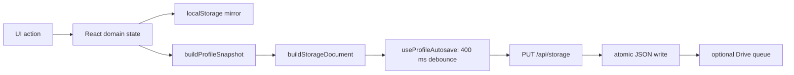

[English](UI.md) | [Русский](UI.ru.md)

# UI: components, state and events

[Architecture](../ARCHITECTURE.md) · [Calls](ENTRY_POINTS_AND_FLOWS.md) · [CSS](STYLES.md) · [Screenshots](SCREENSHOTS.md)

## Bootstrap and navigation

`index.html#root → main.tsx → installDebugCapture → createRoot/StrictMode → App`. `main.tsx` imports `globals.css`. `App.tsx` composes feature hooks and page models; it does not own provider credentials or perform filesystem I/O.

The screen is `ApplicationView = home | catalog | downloads | stats | ratings`. `active: Anime | null` selects the watch screen independently. Folder, collection and settings dialogs are additional state. This is state-driven navigation; it is not a React Router route tree.

`useAppNavigation` supplies `openAnime`, `goHome`, `showCatalog`, `showDownloads`, `showRatings`, `showCurrent`, `openLibrary` and `openSuggestion`. `openLibrary` selects statistics. On Android, `keepActiveOnNavigation` hides the full watch screen without unmounting `Watch`; the same player becomes the floating panel. Closing it clears `active`. Native back first respects an open modal, then changes watch/page state.

## Component ownership

| Surface | Owner | Input and action |
| --- | --- | --- |
| Header/search/status | `components/Header.tsx`, `useHeaderCloudSync` | Search callbacks, profile/save/provider/cloud state |
| Home | `pages/HomePage.tsx` | `HomePageModel` + `HomePageActions` |
| Hero and library | `HomeHero`, `LibrarySections`, `LibraryToolbar`, `HomeCardList` | Resume/trailer, watching/tracking/folders/history tabs; `useHomeCardLimit` adds 10 cards at a time |
| Catalogue | `CatalogPage`, `useCatalogController`, `useCatalogPresentation` | Query/page/filter state → normalized/grouped cards |
| Statistics | `StatisticsPage`, library selectors | Progress/history/folders → derived totals/calendar/genres |
| Ratings | `RatingsPage`, `RatingBoard`, `ScorePicker` | Personal tree and server aggregate; `useCommunityRatings` publishes/retries |
| Watch screen | `components/Player.tsx` (`Watch`) | Family, season/episode/dub/source selection, resume and progress callbacks |
| Direct player | `AnimeSoulPlayer`, menus, timeline preview | Resolved sources, HLS/video events, quality/subtitles/skips |
| Offline | `DownloadPicker`, `DownloadsPage`, `useDownloadManager`, `useOfflinePlayback` | Availability, enqueue/cancel/delete, local media selection |
| Settings | `SettingsCenter`, `settingsCatalog`, `features/settings/*` | Searchable tabs with domain callbacks; persistent values go through profile state or device API |

Pages and large overlays are lazy loaded under Suspense; Vite separates React and the HLS runtime. Library selectors compute data without fetching. A poster/metadata request starts near the viewport; catalogue presentation limits concurrent metadata work.

## State and persistence

Hydration uses `useProfileStorage → resolveActiveProfileDocument → applyStorageProfile/applySnapshot`. A missing save (`404`) bootstraps from the browser mirror. Invalid/server-error saves must not be treated as missing; `storageSafety.ts` guards replacement. Snapshot builders retain unknown fields through the previous envelope/profile/snapshot.

Progress actions go through `createActiveWatchActions`. `toggleEpisodeWatched` retains `manualPrevious` for undo. Display episode keys and `originAnimeId/originEpisode` are distinct. Tracking acknowledges the original episode when a watched mark is newly set. [Data semantics](DATA_MODEL.md).

## Transport and error handling

`lib/http.ts::requestJson<T>` decodes JSON and throws `ApiRequestError(status, code?)`, preferring backend `detail`/`error` text. It is a typed transport helper, not runtime validation of `T`. Catalogue, ratings and party adapters live inside their features; downloads, credentials, dates, Drive and Kodik adapters live in `lib/`. Use AbortSignal and effect cleanup where the caller supports cancellation.

`_sources` and `X-AnimeSoul-*-Status` explain provider degradation; an empty list is different from an error. An unavailable direct stream can fall back to the provider iframe; available controls depend on the provider's messaging support. UI errors should keep existing profile/progress data.

## Browser events

`lib/events.ts` owns typed `emitAppEvent` and `listenAppEvent`; the latter returns an unsubscribe callback. Actual browser names are prefixed with `animesoul:`.

| Event key | Payload / consumers |
| --- | --- |
| `save-status` | `SaveStatus`; profile save → header |
| `api-status`, `kodik-api-status` | `ApiStatus`; transport diagnostics → indicators |
| `party-ping` | state, optional ms/roomId |
| `player-prefs`, `toolbar` | preferences or toolbar position |
| `open-settings`, `close-settings` | tab and optional target title / no payload |
| `open-gdrive-choice` | display initial-sync choice |
| `cast-state` | native `CastState` → player/session controls |

Provider iframe messages, Google popup `GDRIVE_AUTH_SUCCESS`, native back/PiP and `animesoul:kodik-access-changed` are separate bridge/protocol events. Do not conflate them with HTTP routes.

## Player and native connections

`Watch → fetchKodikStream → POST /api/kodik/stream → AnimeSoulPlayer`. HLS sources use hls.js or native support; sources/subtitles/skips are runtime values. `isSameEpisodeDubbingSwitch` and the source request key distinguish a dub change from a new episode so resume can preserve position. Keyboard behavior is implemented by the player and covered by the browser harness.

On Android, `useAndroidCast → lib/cast.ts → AnimeSoulCast.postMessage → CastController`. The bridge accepts only the top local-origin page. `castMediaSource` restricts casting to direct HTTPS online media. `CastSessionBar`, `CastRemotePanel` and native MediaSession carry remote playback state. Download bridges coordinate notifications, foreground monitoring and MediaStore permissions. Browser/PyWebView do not have these Android bridges.

## UI verification

Check library tabs/pagination, blank and loaded states, settings search/focus/close, dark/light colors, narrow and desktop layout, source/dub changes, resume, manual marks, player keyboard/touch, Android mini-player/back/PiP and Cast handoff. The [browser harness](../frontend/tests/player-browser.html) is run via Vite; real media and native behavior require separate device checks.
