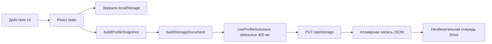

[English](UI.md) | [Русский](UI.ru.md)

# UI: компоненты, состояние и события

[Архитектура](../ARCHITECTURE.ru.md) · [Вызовы](ENTRY_POINTS_AND_FLOWS.ru.md) · [CSS](STYLES.ru.md) · [Скриншоты](SCREENSHOTS.ru.md)

## Запуск и навигация

`index.html#root → main.tsx → installDebugCapture → createRoot/StrictMode → App`. `main.tsx` импортирует `globals.css`. `App.tsx` связывает hooks и модели страниц; ключи источников и файловые операции принадлежат backend.

Экран задаётся `ApplicationView = home | catalog | downloads | stats | ratings`. `active: Anime | null` независимо выбирает просмотр. Папки, коллекции и настройки имеют отдельное состояние. Навигация построена на React state, а не на дереве URL React Router.

`useAppNavigation` предоставляет `openAnime`, `goHome`, `showCatalog`, `showDownloads`, `showRatings`, `showCurrent`, `openLibrary`, `openSuggestion`. `openLibrary` открывает статистику. На Android `keepActiveOnNavigation` скрывает полный просмотр без размонтирования `Watch`: тот же плеер становится плавающей панелью. Закрытие очищает `active`. Native back сначала учитывает открытый modal, затем меняет экран просмотра/страницы.

## Владельцы компонентов

| Поверхность | Владелец | Входы и действия |
| --- | --- | --- |
| Шапка/поиск/статусы | `components/Header.tsx`, `useHeaderCloudSync` | Поиск, профиль, сохранение, API и облако |
| Главная | `pages/HomePage.tsx` | `HomePageModel` + `HomePageActions` |
| Hero и медиатека | `HomeHero`, `LibrarySections`, `LibraryToolbar`, `HomeCardList` | Продолжение/трейлер, вкладки просмотра/отслеживания/папок/истории; `useHomeCardLimit` добавляет по 10 карточек |
| Каталог | `CatalogPage`, `useCatalogController`, `useCatalogPresentation` | Запрос/страница/фильтры → нормализованные карточки франшиз |
| Статистика | `StatisticsPage`, selectors библиотеки | Прогресс/история/папки → итоги, календарь и жанры |
| Оценки | `RatingsPage`, `RatingBoard`, `ScorePicker` | Личное дерево и агрегат; `useCommunityRatings` публикует и повторяет запросы |
| Просмотр | `components/Player.tsx` (`Watch`) | Франшиза, выбор сезона/серии/озвучки/источника, callbacks прогресса |
| Прямой плеер | `AnimeSoulPlayer`, menus, timeline preview | Потоки, HLS/video events, качество, субтитры и skip |
| Офлайн | `DownloadPicker`, `DownloadsPage`, `useDownloadManager`, `useOfflinePlayback` | Доступность, очередь/отмена/удаление, выбор локального файла |
| Настройки | `SettingsCenter`, `settingsCatalog`, `features/settings/*` | Поиск вкладок и domain callbacks; сохранение через профиль либо API устройства |

Страницы и крупные окна загружаются лениво под Suspense; Vite отделяет React и HLS runtime. Чистые selectors не выполняют сеть. Данные карточек запрашиваются около viewport с ограничением параллелизма.

## Состояние и сохранение

Загрузка: `useProfileStorage → resolveActiveProfileDocument → applyStorageProfile/applySnapshot`. При отсутствии файла (`404`) создаётся документ из зеркала браузера. Повреждение/ошибка сервера не равны отсутствию: `storageSafety.ts` защищает от замены. Builders сохраняют неизвестные поля прежнего envelope/profile/snapshot.

Действия прогресса проходят через `createActiveWatchActions`. `toggleEpisodeWatched` сохраняет `manualPrevious` для отмены. Экранный ключ серии отличается от `originAnimeId/originEpisode`. При новой отметке просмотра tracking подтверждает исходную серию. [Семантика данных](DATA_MODEL.ru.md).

## Транспорт и ошибки

`lib/http.ts::requestJson<T>` разбирает JSON и выбрасывает `ApiRequestError(status, code?)`, предпочитая текст backend `detail`/`error`. Тип `T` не означает проверку формы JSON во время исполнения. API каталога, оценок и комнат находятся в features; downloads, credentials, dates, Drive и Kodik — в `lib/`. При поддержке caller используйте AbortSignal и cleanup эффекта.

`_sources` и `X-AnimeSoul-*-Status` показывают деградацию провайдера; пустой список отличается от ошибки. При недоступном прямом потоке можно перейти к iframe; доступные команды зависят от сообщений провайдера. Ошибка UI должна сохранять имеющиеся данные профиля и прогресса.

## События браузера

`lib/events.ts` определяет `emitAppEvent` и `listenAppEvent`; подписка возвращает функцию очистки. Реальные имена получают префикс `animesoul:`.

| Ключ | Данные / потребители |
| --- | --- |
| `save-status` | `SaveStatus`; профиль → шапка |
| `api-status`, `kodik-api-status` | `ApiStatus`; диагностика → индикаторы |
| `party-ping` | state, необязательные ms/roomId |
| `player-prefs`, `toolbar` | Настройки или положение панели |
| `open-settings`, `close-settings` | tab и optional targetTitle / без данных |
| `open-gdrive-choice` | Открытие первого выбора sync |
| `cast-state` | Нативный `CastState` → управление плеером/сессией |

Сообщения iframe, Google popup `GDRIVE_AUTH_SUCCESS`, native back/PiP и `animesoul:kodik-access-changed` относятся к отдельным мостам и протоколам. Это не HTTP-маршруты.

## Плеер и нативные связи

`Watch → fetchKodikStream → POST /api/kodik/stream → AnimeSoulPlayer`. Для HLS применяется hls.js или нативная поддержка; sources/subtitles/skips существуют в runtime. `isSameEpisodeDubbingSwitch` и ключ запроса различают смену озвучки и новую серию, сохраняя позицию. Клавиатурное управление реализовано в плеере и проверяется браузерным harness.

Android: `useAndroidCast → lib/cast.ts → AnimeSoulCast.postMessage → CastController`. Мост доступен только верхней странице локального origin. `castMediaSource` допускает прямые HTTPS онлайн-потоки. `CastSessionBar`, `CastRemotePanel` и MediaSession получают удалённое состояние. Download-мосты координируют уведомления, foreground monitoring и разрешения MediaStore. В браузере/PyWebView Android-мостов нет.

## Проверка UI

Проверяйте вкладки и порционную загрузку, пустые/заполненные экраны, поиск/focus/закрытие настроек, светлую/тёмную темы, узкую/широкую раскладку, смену источника/озвучки, resume, ручные отметки, клавиатуру/touch, Android mini-player/back/PiP и Cast. [Browser harness](../frontend/tests/player-browser.html) запускается через Vite; реальные потоки и нативные функции проверяются отдельно на устройствах.
